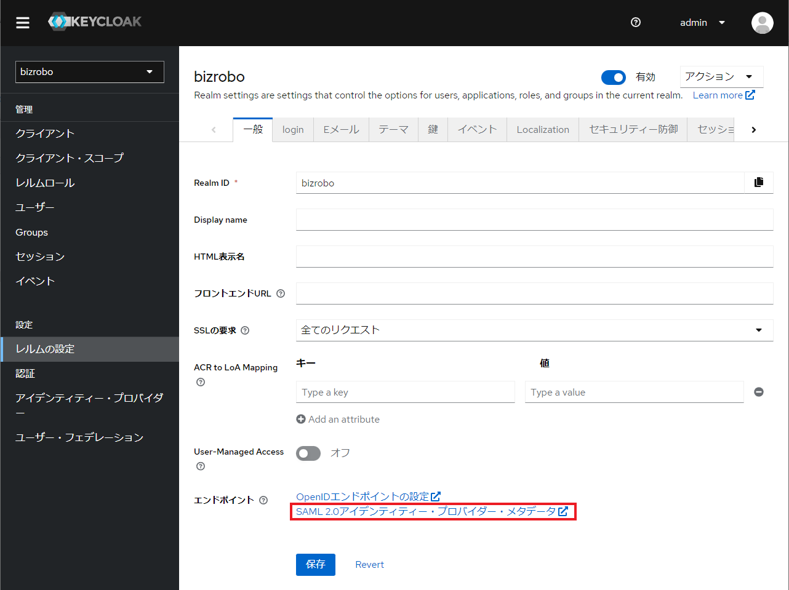
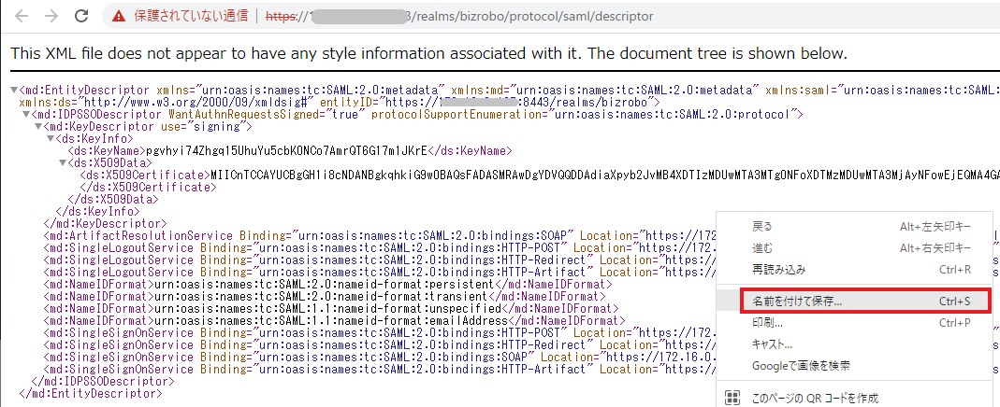

# Management Console 設定ファイルの更新

Management Console の SAML 認証を有効化するために以下 2 つのファイルを更新します。[^1]

- webapps/mc/WEB-INF/login.xml
- webapps/mc/WEB-INF/spring/saml.xml

[^1]: Management Console のアプリが `mc.war` という名称で Tomcat9 上に展開されている前提の記述です。

> [!NOTE] 設定ファイルのバックアップ
システムの設定ファイルを変更する際には、必ずバックアップを取得したうえで実施しましょう。

## login.xml の更新

`login.xml` を変更して SAML 認証を有効化します。

### SAML 機能の有効化

下記に従い、`authenticationConfiguration` Bean 内の `useSaml` オプションの値を `true` に書き換えます。

**設定値:**
```
true
```

**設定例：webapps/mc/WEB-INF/login.xml**
```diff
<!-- Default is internal User management. To enable LDAP change useLdap property to true -->
<bean id="authenticationConfiguration" class="com.kapowtech.scheduler.server.spring.security.AuthenticationConfiguration">
    <property name="useLdap" value="false"/>
    <property name="useSiteMinder" value="false"/>
-   <property name="useSaml" value="false"/>
+   <property name="useSaml" value="true"/>

    <!-- set this to true if you want to create the user admin, regardless of the authentication configuration above -->
    <property name="createAdmin" value="false"/>
</bean>
```

> [!NOTE] LDAP との併用
> `login.xml` の `authenticationConfiguration` Bean で `useLdap` オプションと `useSaml` オプションに `true` を指定することで、LDAP 認証と SAML 認証を同時に使用できます。詳細については、Kofax RPA管理者ガイドの「[ユーザーのオリジンと認証](https://docshield.kofax.com//RPA/ja_JA/11.4.0-vcsft2fhaw/print/KofaxRPAAdministratorsGuide_JA.pdf#named_unique_68)」を参照してください。
> LDAP 認証と SAML 認証の両方を使用する場合、Management Console への SSO には SAML が使用され、サービスの認証 (Design Studio への接続など) には LDAP が使用されます。

## saml.xml の修正

`webapps/ROOT/WEB-INF/spring/saml.xml` ファイルを修正し、SAML の設定を行います。

#### groupsAttributes

グループ化属性。Management Console へのユーザーアクセスは、特定のユーザーが属するグループによって管理されます。ID プロバイダーでユーザーに割り当てられているグループのリストを示す SAML アサーションメッセージの属性名に一致する名前を、1 つまたはリストで指定します。

```
groups
```

#### idpName

ID プロバイダーの名前。可能な値は、`OKTA`、`ONELOGIN`、および `AZURE` です。それ以外の場合は、`DEFAULT` に設定します。

```
DEFAULT
```

#### idpUserNameRegex

ユーザー名（フルネーム）の入力制限。デフォルトでの入力可能文字は英数字と空白のみなので、日本語の入力を許可するためにパターンを追加します。

```
^[a-zA-Z0-9 ぁ-んァ-ヶー一-龠]*$
```

**設定例：webapps/mc/WEB-INF/spring/saml.xml**
```diff
<!-- modify the groups attributes list and the admingroups here to match your setup -->
<bean id="samlAuthenticationProvider" class="com.kapowtech.scheduler.server.spring.security.GroupProvidingSAMLAuthenticationProvider" lazy-init="true">
	<constructor-arg ref="platformEMF"/>
	<property name="internalAuthenticationProvider" ref="internalAuthenticationProvider"/>
	<!--  -->
	<property name="customerNameMapper" value="false"/>
	<property name="customerNameMapperIdentifier" value="email"/>
	<property name="groupsAttributes">
		<list>
-           <value>AdminGroup</value>
+           <value>groups</value>
		</list>
	</property>
	<property name="adminGroups">
		<list>
			<value>KapowAdmins</value>
		</list>
	</property>
	<property name="administratorGroups">
		<list>
			<value>RpaAdministrators</value>
		</list>
	</property>
	<!-- set to false, if you do not want groups to be assigned based on the SAML response message -->
	<property name="assignGroups" value="true"/>

	<property name="consumer" ref="webSSOprofileConsumer"/>

	<property name="email" value="email"/>
	<property name="firstname" value="firstname"/>
	<property name="lastname" value="lastname"/>

-   <property name="idpName" value="ONELOGIN"/>
+   <property name="idpName" value="DEFAULT"/>
	<property name="idpGroupNameSeperator" value=";"/>

-   <property name="idpUserNameRegex" value="^[a-zA-Z0-9 ]*$"/>
+   <property name="idpUserNameRegex" value="^[a-zA-Z0-9 ぁ-んァ-ヶー一-龠]*$"/>
	<property name="idpEmailRegex" value="^[A-Z0-9._%+-]+@[A-Z0-9.-]+\\.[A-Z]{2,6}$"/>

</bean>
```

#### useSamlSingleLogout

Management Console でログアウトした際に Keycloak 側でも同様にログアウトするかどうかを設定します。 `true` に設定しない場合は、Management Console でログアウトしても Keycloak 側のセッション情報を参照し、強制的に再ログインします。

```
true
```

**設定例：webapps/mc/WEB-INF/spring/saml.xml**
```diff
<bean id="useSamlSingleLogout" class="java.lang.Boolean">
-    <constructor-arg value="false"/>
+    <constructor-arg value="true"/>
</bean>
```

#### entityId

Management Console の URL に saml/login を加えたものであり、SAML 対応のサービスプロバイダーを一意に識別するための識別子です。

```
http://localhost:8080/mc/saml/login
```

#### entityBaseURL

Management Console のベース URL。[^2]

    [^2]: ブラウザーや外部プログラムからアクセスする際のエンドポイントとしてのURLであり、場合によってはリバースプロキシのURLを指定します。

```
http://localhost:8080/mc
```

**設定例：webapps/mc/WEB-INF/spring/saml.xml**
```diff
<bean id="metadataGeneratorFilter" class="org.springframework.security.saml.metadata.MetadataGeneratorFilter" lazy-init="true">
	<constructor-arg>
		<bean class="org.springframework.security.saml.metadata.MetadataGenerator">

-           <property name="entityId" value="http://mc-deployment-url/ManagementConsole/saml/login"/>
+           <property name="entityId" value="http://localhost:8080/mc/saml/login" />
			<property name="requestSigned" value="false"/>

-           <property name="entityBaseURL" value="http://mc-deployment-url/ManagementConsole"/>
+           <property name="entityBaseURL" value="http://localhost:8080/mc" />

			<property name="extendedMetadata">
				<bean class="org.springframework.security.saml.metadata.ExtendedMetadata">
					<property name="idpDiscoveryEnabled" value="false"/>
					<property name="signMetadata" value="false"/>
				</bean>
			</property>
		</bean>
	</constructor-arg>

</bean>
```

> [!NOTE] entityId の値について
> SP の `entityID` とは、SAML対応のサービスプロバイダーを一意に識別するための識別子であり、SAMLメタデータやSAMLリクエストやレスポンスに含まれます。
> 
> `entityID` の要件は、SAML 2.0メタデータ仕様に従って以下のように定義されています。
> - URI（Uniform Resource Identifier）である必要があります。[^3]
>- URL（Uniform Resource Locator）であることが推奨されます。[^4]
> - SAMLメタデータURLを使用することが慣習となっています。[^5]

[^3]: URIとは、インターネット上のリソースを一意に識別するための文字列です。
[^4]: URLとは、インターネット上のリソースの場所を示すためのURIの一種です。
[^5]: SAMLメタデータURLとは、SAMLメタデータを提供するためのURLです。

### IdP メタデータ設定

SAML において IdP と SP 間の信頼関係を構築するため、それぞれに情報を定義したメタデータを設定します。

SPはIdPのメタデータを受け取り、自身の設定ファイルに統合することで、IdPが提供する認証サービスを利用できます。

Keycloak（IdP）から下記のメタデータを抽出し、それを Management Console（SP）へ取り込み、[後続のステップ](setup-client.md)では逆に SP からメタデータを抽出し、それを IdP に取り込みます。下記URLが無効な場合、Keycloakの画面から取得することも可能です。[^6]

[^6]: bizroboレルムの一般ページ内にある「SAML 2.0アイデンティティー・プロバイダー・メタデータ」をクリックしてメタデータを表示します。
	

**IdPメタデータのURL**
```
https://localhost:8443/realms/bizrobo/protocol/saml/descriptor
```

メタデータの取り込み方法には以下の2つがあります。[^7]

[^7]: 自己証明書の利用などセキュリティ的に十分ではない環境ではURL指定によるアクセスがブロックされてしまうことがあるので、ファイルによる取り込み方法をまずはお勧めします。

- IdPメタデータをファイルとして指定する **ファイルによる取り込み**
- IdPメタデータのURLを指定する **URL による取り込み**


> [!WARNING] 実施前の確認
> 以降の手順は IdP（Keycloak）側にて既に SP（Management Console）と交換すべき上記情報の設定が済んでいることが前提となります。
> 
> IdPのレルム設定が未実施の場合、一旦上記までの変更を保存したうえで Tomcatを再起動しKeycloakの「レルムの設定」を実施した後で再度実施ください。

#### ファイルによる取り込み

コメントアウトされている `<bean>` タグを有効化し、以下の手順で IdP メタデータ ファイルを設定します。

1. 前述の `IdPメタデータのURL` にアクセスし、IdPメタデータを名前を付けて保存（`idp.xml`）します。
	

2. 保存したファイルを Tomcat が稼働している以下のフォルダへ移動します。

	**Tomcat をインストールしているフォルダの配下**
```
{Tomcatインストールフォルダ}/webapps/mc/WEB-INF/classes/security
```


```diff
<bean id="metadata" class="org.springframework.security.saml.metadata.CachingMetadataManager" lazy-init="true">
	<constructor-arg>
		<list>
<!--           <bean class="org.opensaml.saml2.metadata.provider.HTTPMetadataProvider" lazy-init="true">
				<constructor-arg>
					<value type="java.lang.String">http//idp-metadata-url</value>
				</constructor-arg>
				<constructor-arg>
					<value type="int">10000</value>
				</constructor-arg>
				<property name="parserPool" ref="parserPool"/>
			</bean>-->

-     <!--  <bean class="org.opensaml.saml2.metadata.provider.FilesystemMetadataProvider">
+           <bean class="org.opensaml.saml2.metadata.provider.FilesystemMetadataProvider">
				<constructor-arg>
					<value type="java.io.File">classpath:security/idp.xml</value>
				</constructor-arg>
				<property name="parserPool" ref="parserPool"/>
-           </bean> -->
+           </bean>
		</list>
	</constructor-arg>
</bean>
```

#### URL による取り込み

コメントアウトされている `<bean>` タグを有効化し、`java.lang.String` タグに IdP メタデータの URL を指定します。

```diff
<bean id="metadata" class="org.springframework.security.saml.metadata.CachingMetadataManager" lazy-init="true">
	<constructor-arg>
		<list>
- <!--      <bean class="org.opensaml.saml2.metadata.provider.HTTPMetadataProvider" lazy-init="true">
+           <bean class="org.opensaml.saml2.metadata.provider.HTTPMetadataProvider" lazy-init="true">
				<constructor-arg>
-                   <value type="java.lang.String">http//idp-metadata-url</value>
+                   <value type="java.lang.String">https://localhost:8443/realms/bizrobo/protocol/saml/descriptor</value>
				</constructor-arg>
				<constructor-arg>
					<value type="int">10000</value>
				</constructor-arg>
				<property name="parserPool" ref="parserPool"/>
-           </bean>-->
+           </bean>

			<!--  <bean class="org.opensaml.saml2.metadata.provider.FilesystemMetadataProvider">
				<constructor-arg>
					<value type="java.io.File">classpath:security/idp.xml</value>
				</constructor-arg>
				<property name="parserPool" ref="parserPool"/>
			</bean> -->
		</list>
	</constructor-arg>
</bean>
```

## ファイル修正の適用

Tomcat サービスを再起動し、ファイル修正を反映する。
