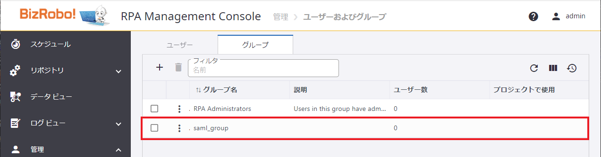

!!! note "グループ情報の事前設定"

    SAMLでは MCと Keycloak とユーザー情報がお互いそろっている前提で認証を一律で実施するだけであり、アカウントや組織の情報を管理するわけではないので、最初に情報を揃えておく必要があります。（アカウントや組織情報を連携するのはLDAPとかの話）

SAML 認証時、権限が割り当てられたグループを事前に Management Console 側で作成する必要があります。  
以下にグループ作成・プロジェクト割り当て手順を記載。  
管理者用グループ`KapowAdmins`はデフォルトで設定済のため作成、グループ割り当て不要。

## グループの作成（ManagementConsole）

1.  以下の URL から Management Console へログインします。

    [http://localhost/login.jsp](http://localhost/login.jsp)

    ***

1.  `管理` メニューから `ユーザーおよびグループ` をクリックし、 `グループ` タグを選択します。

    

    ***

1.  `＋` アイコンをクリックしてダイアログを開き、作成するグループ名（`saml_group`）を入力後、`OK` ボタンで確定します。

    

    ??? note annotate "メモ"

        Keycloak では SAML JITにより IdP側に設定したユーザ情報がSP側に連携されるため、Management Console 上にユーザー情報は作成しません。

    ***

1.  グループが作成されたことを確認します。

    

## プロジェクトへの割り当て（ManagementConsole）

本手順書では既存の `Default project` を例にとり、作成したグループのプロジェクトへの割り当て手順を解説します。

1.  `管理` メニューから `プロジェクト` を選択します。

    ***

1.  権限を割り当てるプロジェクト[^1]の `メニューを表示` アイコンをマウスオーバーし、`編集` を選択します。

    

    ***

1.  `権限` タブを表示して `作成` ボタンをクリック、適当な `プロジェクトロール` と作成した `グループ` を割り当てます。

    

    ***

1.  `OK` をクリックし、情報を登録します。

[^1]: 手順書上は `Default project` により例示
