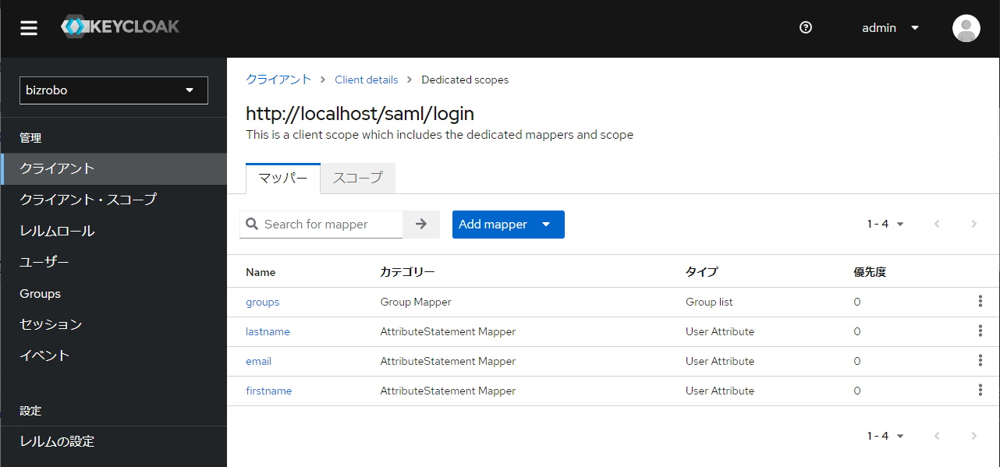
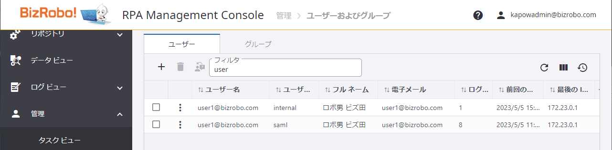
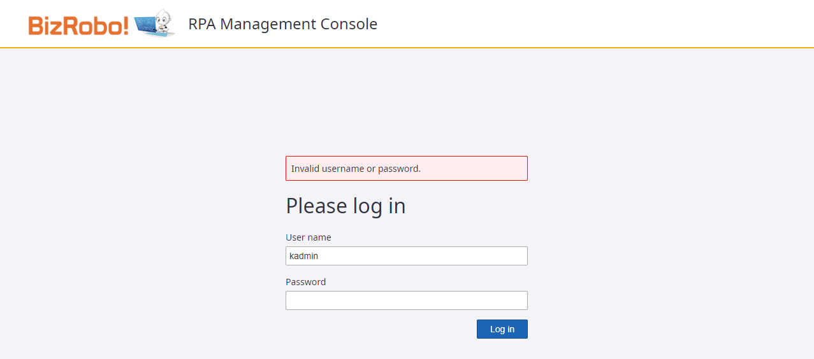

## ユーザー

#### Q. ユーザーの属性に `firstname` と `lastname` 以外の項目が設定されているときの影響は？

: ありません。

    クライアントへSAMLを使ってログインをする際に必要な情報は `クライアント` 設定の中で `クライアント・スコープ` として `マッパー` の設定が行われています。



---

#### Q. 既に MC（Internal）に登録されているユーザと重複するユーザーを Keycloak で作成するとどうなりますか？

: オリジンが異なるので、同じユーザー名であっても異なるユーザーとして判断されます。



---

#### Q. 一度 SAML を有効化したら、これまでの MC へのログインは出来ませんか？

: 出来ます。

    `saml.xml` に設定した `entityBaseURL` にアクセスされた場合には Keycloak にリダイレクトされて SAML 経由のログインが必要になりますが、以下のリソースのパスへ直接アクセスすることで SAML を通さない直接的なログインも併用することが可能です。

```
	http://{MCのentityBaseURL}/login.jsp
```

    ただし、SAML でログインする際のアカウント情報は Keycloak に認証情報を保持している一方で、Management Console へ直接ログインする際のアカウント情報は Management Console 内に保持されているため、Management Console のログイン画面から SAML アカウントでのログインはできません。



---

#### Q. SAML 認証済みのアカウントに対して、MC 側のユーザー情報を削除したらどうなりますか？

: SAML を使った認証には影響ありません。

    当該ユーザが所属する `グループ`の削除 や、`プロジェクト` の削除等が行われた場合には MC アカウントとしての有効性を失うためログインが不能となります。

    ただ、ユーザー情報を削除しただけであれば、Keycloak は SAML JIT により MC へログインするため、再度 SAML 認証を実施したタイミングで MC 側にユーザー情報が再度作成されます。

---

#### Q. SAML 認証済みのアカウントに対して、Keycloak 側のユーザー情報を削除したら MC 上の SAML アカウントも削除されますか？

: されません。

    SAMLとは「認証」の仕組みでありアカウント情報の同期をする仕組みではありません。Keycloak上のアカウント情報を削除することにより、そのユーザーアカウントを使用したMCへのログインはできなくなりますが、ユーザー名やメールアドレスなどの情報はMC内に残ってしまいますので、MCから別途当該データを削除する必要があります。

---

#### Q. SAML 認証済みのアカウントに対して、Keycloak 側のユーザー情報を変更したら MC 上の SAML アカウントも更新されますか？

: 変更する箇所によって結果が変わります。

**キー情報となっている email アドレスを変更した場合。**

    :    次回 SAML 認証にて MC にログインしたタイミングで 新しいユーザーアカウントが生成されます。（古いアカウントは残ります）

**キー情報以外の firstname や lastname 、group を変更した場合。**

    :    次回 SAML 認証にて MC にログインしたタイミングで変更後の内容に既存のアカウントが更新されます。

## MC 以外との SAML 認証

#### Q. Keycloak 登録アカウントを利用して Kapplets に SAML 認証することはできますか？

: <font color="red">検証中</font>

---

#### Q. Keycloak 登録アカウントを DAS に設定して、DAS から MC に対して SAML 認証させることはできますか？

: DAS は SAML に対応していないため、出来ません。MC 内に登録されたユーザー情報を直接指定してください。

    ただし、BizRobo! v11.4 以降は OAuth2 対応となり、ユーザーアカウントをDASに指定する必要がなくなります。

---

#### Q. Keycloak 登録アカウントを Design Studio に設定して、Design Studio から MC に対して SAML 認証させることはできますか？

: Design Studio は SAML に対応していないため、出来ません。MC 内に登録されたユーザー情報を直接指定してください。

    ただし、BizRobo! v11.5 以降は何らかの変更が実施される予定です。

---

#### Q. Keycloak 登録アカウントを RoboServer に設定して、RoboServer から MC に対して SAML 認証させることはできますか？

: RoboServer は SAML に対応していないため、出来ません。MC 内に登録されたユーザー情報を直接指定してください。

    ただし、BizRobo! v11.5 以降は OAuth2 対応となり、ユーザーアカウントをDASに指定する必要がなくなります。

## SSO

#### Q. Keycloak では SP Initialized SSO だけではなく IdP Initialized SSO も可能ですか？

: 可能です。ただし、この手順書の範囲では現在対象としてません。
