# Keycloak の初期設定

> [!WARNING] warning "ホスト名の指定について
>
>Keycloak へアクセスするためには `keycloak.conf` の `hostname` に指定したホスト名を指定する必要があります。
> 本手順書では `localhost:8443` をホスト名として設定しているため、今後すべての Keycloak へのアクセスは localhost:8443 を用いて実施します。

## 管理者アカウントの作成

1.  `https://localhost:8443/`にアクセスします。
    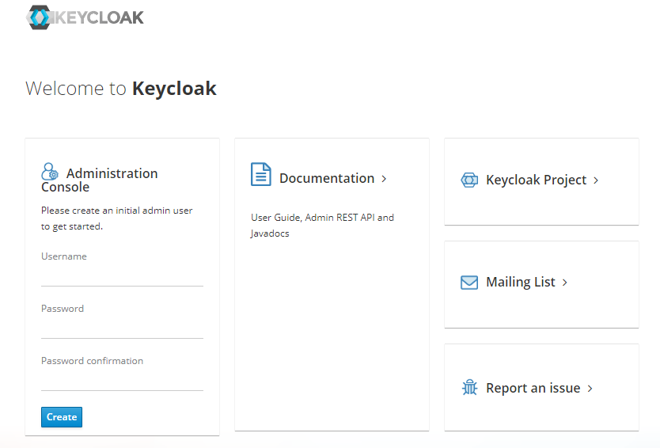

2.  `Username` と `Password` を設定して管理者を作成します。
    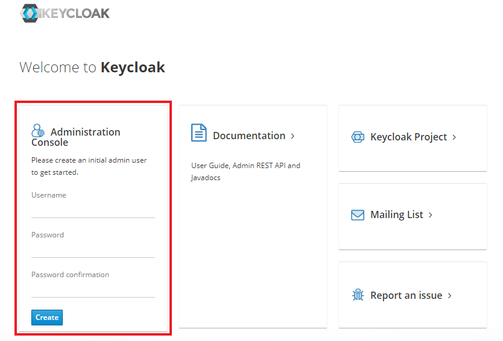

| 項目     | 値    |
| -------- | ----- |
| Username | admin |
| Password | admin |

3.  以下の通りアカウントが作成されることを確認します。
    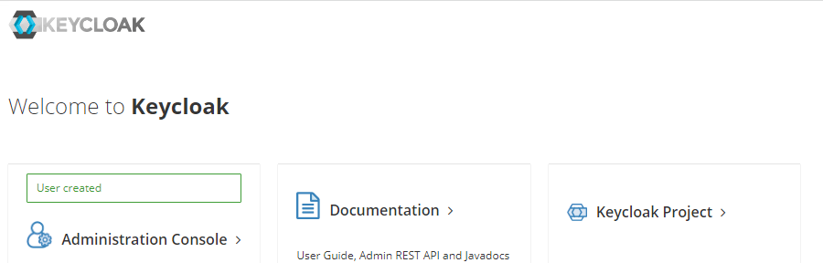

## 管理者ログイン

1.  `Administration Console` をクリックし、ログイン画面を開きます。
    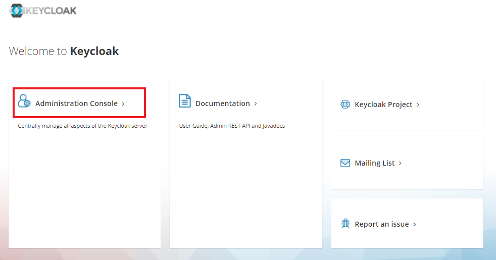

2.  ユーザー情報を入力し、ログインします。
    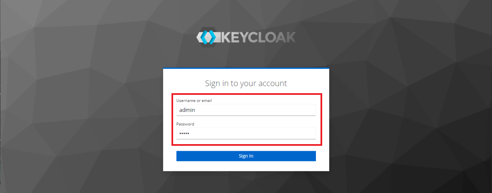

> [!NOTE] ログイン画面が表示されない場合
>
> 画面に「Loading the admin console」というメッセージが表示されたままログイン画面にリダイレクトされない場合は、`keycloak.conf` の `hostname` に指定したホストをURLとして指定してください。

3.  管理ユーザーとして `master realm` のトップ画面が表示されます。
    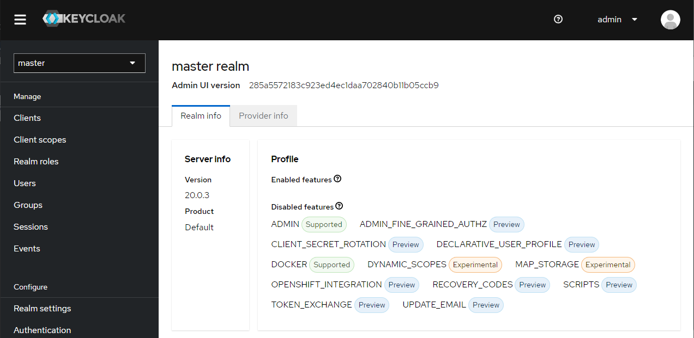

## Keycloak の日本語化

1.  サイドメニューから `Realm setting` ページを開き、`Localization` タブをクリックします。
    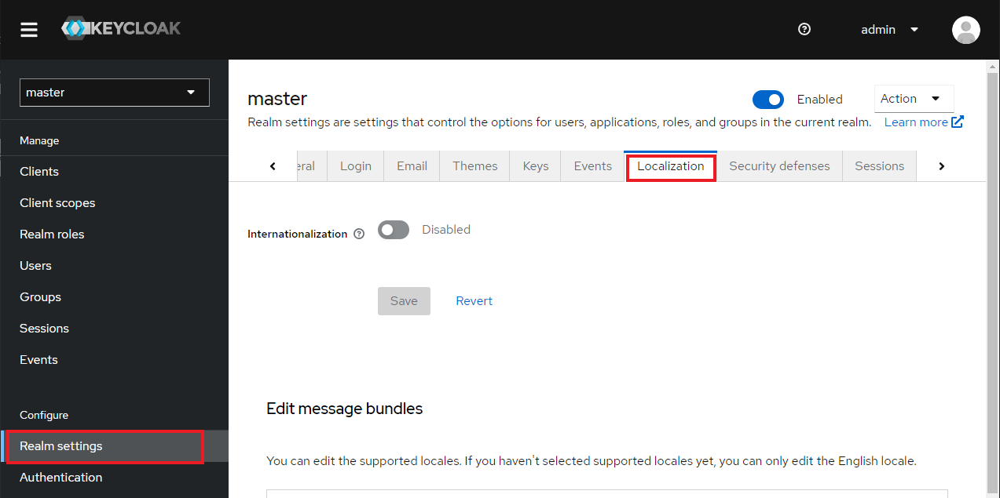

2.  以下の通り項目を設定し、`Save` ボタンをクリックします。
    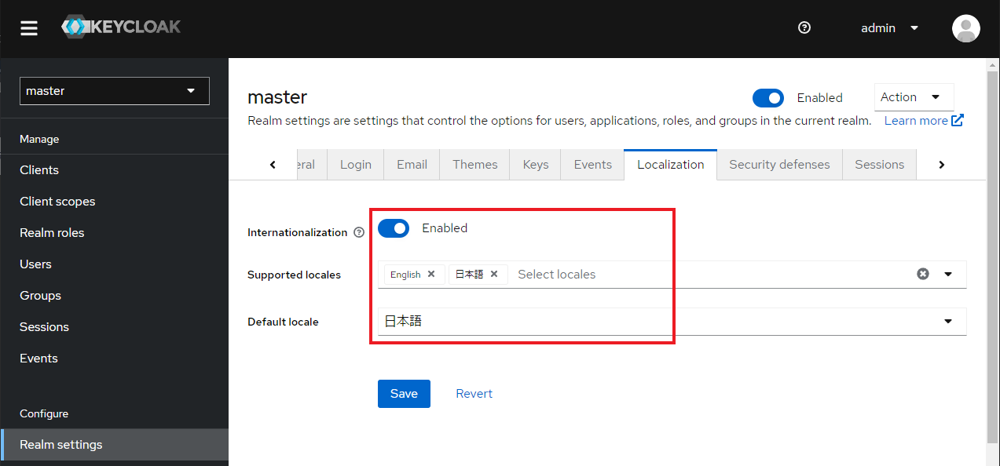

| 項目                 | 設定     |
| -------------------- | -------- |
| Internationalization | Enabled  |
| Supported locales    | `日本語` |
| Default locale       | 日本語   |

3.  一度 `Sign out` し、表示が日本語に変更されることを確認します。
    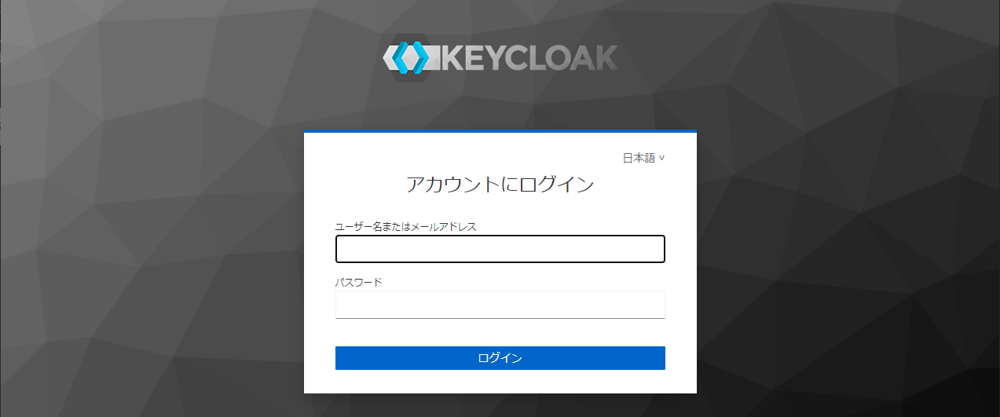

## パスワード・ポリシーの設定

パスワード・ポリシーを設定し、不正アクセスに対してのセキュリティ強化が可能。  
※デフォルトで設定されているパスワードポリシーは無し。

以下に設定手順を記載。

1.  サイドメニューから `認証` ページを開き、`ポリシー` タブをクリックします。
    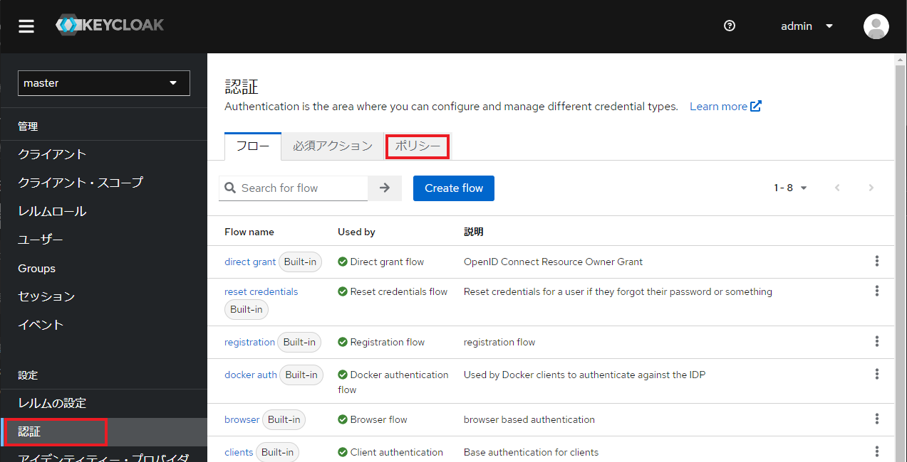

2.  `Add policy` をクリックし、プルダウンメニューから設定するポリシーを選択します。
    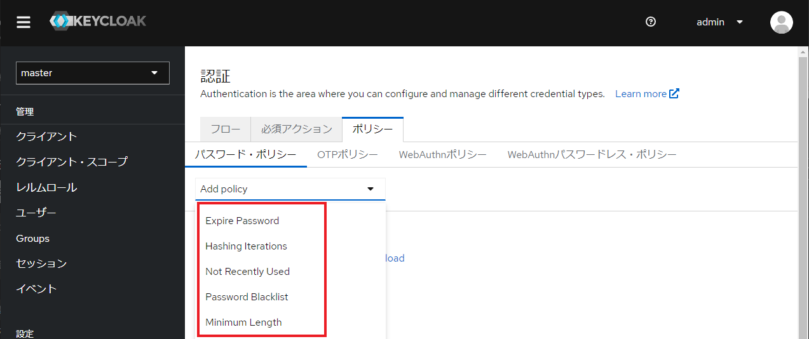

| ポリシー             | 説明                                                                                                                    |
| -------------------- | ----------------------------------------------------------------------------------------------------------------------- |
| Expire Password      | パスワードの有効期限を指定します。パラメータで日数を指定します。 追加時のデフォルトは`365`です。                    |
| Hash Iterations      | パスワードのハッシュ化に使用するイテレーション数を指定します。 追加時のデフォルトは`27,500`です。                   |
| Not Recently Used    | パスワード変更時に、過去に使用したパスワードと重複しないことをチェックします。 追加時のデフォルトは`3`です。        |
| Password Blacklist   | パスワードがブラックリストに含まれていないことをチェックします。 ブラックリストは`テキストファイル`で提供されます。 |
| Minimum Length       | パスワードの最小長を指定します。 追加時のデフォルトは`8`です。                                                      |
| Regular Expression   | パスワードが正規表現にマッチすることをチェックします。 正規表現は`パラメータ`として指定します。                     |
| Not Username         | パスワードがユーザー名と同じでないことをチェックします。 追加時のデフォルトは`無効`です。                           |
| Not Email            | パスワードがメールアドレスと同じでないことをチェックします。 追加時のデフォルトは`無効`です。                       |
| Special Characters   | パスワードに含める必要がある特殊文字の数を指定します。 追加時のデフォルトは`1`です。                                |
| Uppercase Characters | パスワードに含める必要がある大文字の数を指定します。 追加時のデフォルトは`1`です。                                  |
| Lowercase Characters | パスワードに含める必要がある小文字の数を指定します。 追加時のデフォルトは`1`です。                                  |
| Digits               | パスワードに含める必要がある数字の数を指定します。 追加時のデフォルトは`1`です。                                    |
| Hashing Algorithm    | パスワードのハッシュ化に使用するアルゴリズムを指定します。 追加時のデフォルトは`pbkdf2-sha256`です。                |
| Maximum Length       | パスワードの最大長を指定します。 追加時のデフォルトは`64`です。                                                     |

3.  選択したポリシーの設定を行います。
    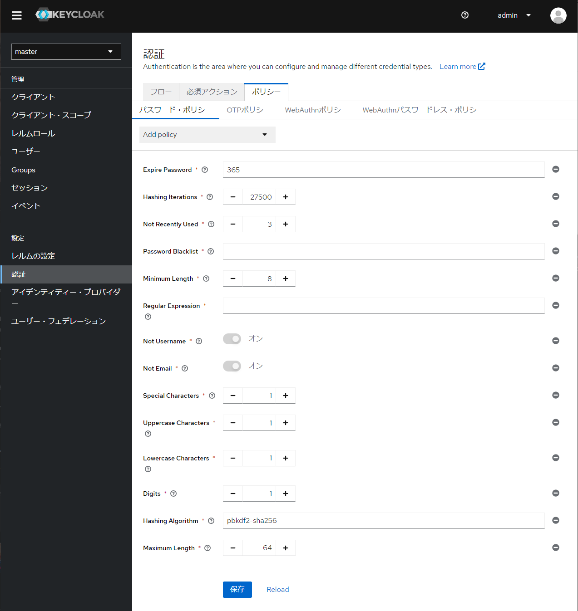
