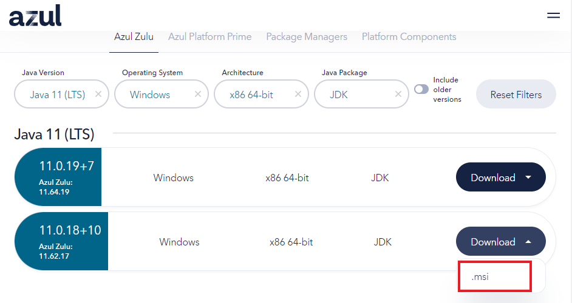
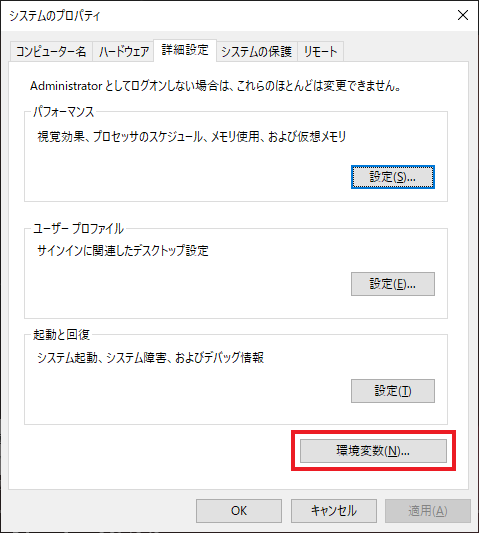
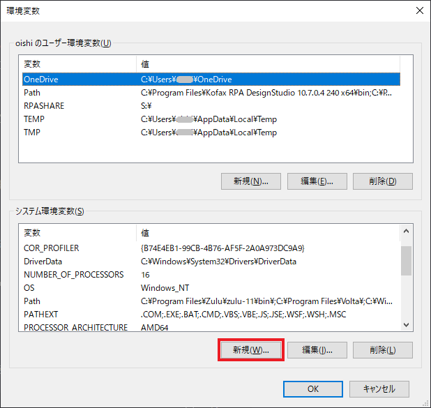
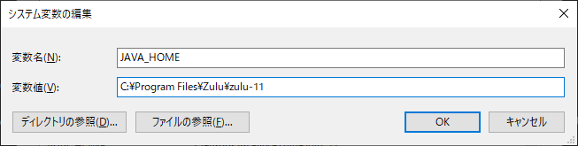

# OpenJDK の準備

Keycloak は Java 製の OSS アイデンティティ＆アクセスマネジメントシステムであるため、環境構築にあたっては Java ランタイムが必要となります。

Java のバージョンとしては 11 以降が必要です。本手順書においては以下バージョンの JDK を前提として構築を進めます。

**Javaのバージョン確認:**
```
java -version
# openjdk version "11.0.16.1" 2022-07-19 LTS
# OpenJDK Runtime Environment Zulu11.58+23-CA (build 11.0.16.1+1-LTS)
# OpenJDK 64-Bit Server VM Zulu11.58+23-CA (build 11.0.16.1+1-LTS, mixed mode)
```

## JAVA の OpenJDK 11 のインストール

本手順書では OpenJDK として Azul の OpenJDK を利用した構築手順を示します。

1.  [公式サイト](https://www.azul.com/downloads/?package=jdk)にアクセスします。
2.  利用環境に合わせた条件を設定します。
    
3.  表示されたバージョンの中から`.msi`をクリックし、インストーラーをダウンロードします。
4.  インストーラーを起動し、表示されるインストールウィザードに従って手続きを実施します。

## JAVA_HOME の 設定

Keycloak を実行するためには 環境変数として Java の `path`が通っているだけではなく、JAVA_HOME の設定を求められます。
以下の手順に沿って実施してください。

1.  「win」+「R」 を押下して `ファイル名を指定して実行` を起動します。
2.  以下の文字列を指定して`OK`をクリック、`システムのプロパティ` が表示後に `詳細設定` タブを選択します。
    ```title="コピーして貼り付け"
    sysdm.cpl
    ```

    

 3.  `環境変数(N)...` をクリックして `環境変数` を表示します。

	 

4.  `システム環境変数` にの `新規` を選択し、`JAVA_HOME` を追加します。

    

5.  以下の通り設定し、`OK` で確定します。

    

6.  変更を保存するために `OK` をクリックします。
