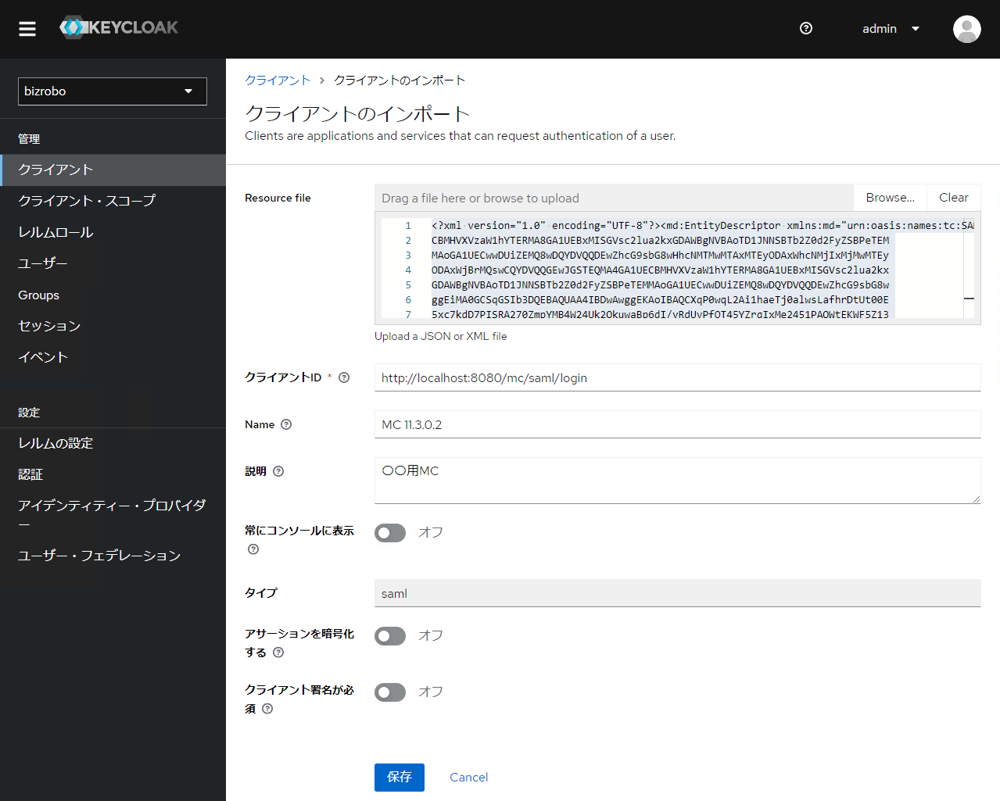
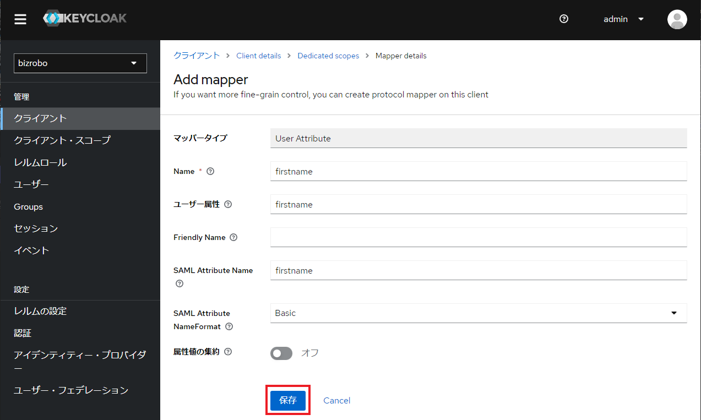

# Management Console のメタデータファイル取得

Keycloak に Client を登録するためのメタデータを Management Console からダウンロードします。

!!! warning "メタデータ取込前の注意"

    メタデータをダウンロードする前に Management Console 側で `saml.xml` の設定が完了していること、その後 Tomcat を再起動していることを確認のうえ、以下のステップを実行してください。

1.  以下の URL にアクセスし、Management Console からメタデータ（`spring_saml_metadata.xml`）をダウンロードします。

    ```title="SPメタデータのURL"
    http://localhost:8080/mc/saml/metadata
    ```

## クライアント設定

### クライアント作成

1.  サイドメニューから `クライアント` を選択し `クライアントのインポート` リンクをクリックします。

    

    ***

1.  `Resource file` の `Browse...` をクリックし、Management Console からダウンロードした `spring_saml_metadata.xml` ファイルを読み込みます。

    

    ***

1.  読み込まれた情報に対して以下を実施します。

    1.  `クライアントID` が MC の `entityId` と同じ値であることを確認します。
    1.  `Name` と `説明` 欄にわかり易いラベルを設定します。
    1.  `アサーションを暗号化する`[^1] と `クライアント署名が必須`[^2] をオフに切り替えます。

    

    [^1]: SAML アサーションをクライアントの公開鍵で AES を使い暗号化すべきか設定します。
    [^2]: クライアントが SAML リクエストとレスポンスを署名するか、そしてそれらを検証すべきどうかか設定します。

    ??? note "アサーションの暗号化について"

        Keycloak とクライアント（MC）でやり取りする情報が傍受されないように、本番運用時には Keycloak だけでなく MC も HTTPS 通信を実装しましょう。また、それに加え `アサーションを暗号化` することにより通信経路上のデータのみでなく、サーバ上でも暗号化された状態で SAML アサーションを保持することができます。[^3]

    [^3]: これにより、SAML アサーションの内容を見られるのは SP 側の秘密鍵を持つ者だけになります。

    ??? note "クライアント署名について"

        クライアント署名により以下のメリットがあります。

        - 送信元の `真正性` を検証でき、偽造や改ざんされたSAMLリクエストやレスポンスを拒否できます。
        - `完全性` を検証でき、通信経路上でSAMLリクエストやレスポンスが改ざんされたかどうかを検出できます。
        - `否認防止` を実現でき、送信元がSAMLリクエストやレスポンスの送信を否認することを防げます。

    ***

1.  `保存` をクリックしてクライアント情報を確定します。

    ***

1.  クライアントが作成されたことを確認します。

    

### マッパーの設定

マッパーは SAML 認証処理中にユーザーの属性情報を MC と変換するための機能です。マッパーは Keycloak がリクエストを認証する際に、ユーザーの属性情報をクライアントアプリケーションに提供するために使用されます。

マッピングに必要な情報は `email`、`firstname`、`group`、`lastname` の 4 つが MC により指定されています。

1.  サイドメニュー `クライアント` > `mc-11.3.0.2` を選択し `クライアント・スコープ` タブ内の `mc-11.3.0.2-dedicated` リンクをクリックします。

    

    ***

1.  `Configure a new mapper` をクリックする。

    

    ***

1.  以下の設定でマッパーを作成します。

    

    | Mapper type    | Name      | User Attribute | SAML Attribute Name |
    | -------------- | --------- | -------------- | ------------------- |
    | User Attribute | firstname | firstname      | firstname           |

    ***

1.  必要項目を入力し、`保存` します。

    

    ***

1.  `Dedicated scopes` をクリックし、一覧画面に戻ります。

    

    ***

1.  同様に以下 `Add mapper` から `By configuration` をクリックして 3 つのマッパーを作成します。

    

    | Mapper type    | Name     | User Attribute | SAML Attribute Name |
    | -------------- | -------- | -------------- | ------------------- |
    | User Attribute | lastname | lastname       | lastname            |
    | User Attribute | email    | email          | email               |

    | Mapper type | Name   | Group Attribute Name | Full group path |
    | ----------- | ------ | -------------------- | --------------- |
    | Group list  | groups | groups               | OFF             |

    ***

1.  以下の通り属性が登録されることを確認します。

    

??? info "role_list の削除"

    デフォルトで `role_list` クライアント・スコープが作成されますが、SAML クライアントには必要のないマッパー情報が含まれている可能性があります。これは SAML クライアントに直接の影響はありませんが、不要な情報が含まれているために管理上の混乱を招く可能性があります。

    ただ、SAML クライアントを作成する場合、不要なマッパーを除去することが推奨され、管理上の混乱を避けることができ、Keycloak サーバーのパフォーマンスに微小な改善をもたらすことができます。

    また SAML クライアントに必要なマッパーは、前項の様にクライアントスコープを作成することで明示的に指定することができます。必要なマッパーのみを含むクライアントスコープを作成し、SAML クライアントに対してそのクライアントスコープを割り当てることができ、必要な情報のみが提供されるようになり、よりスリムな構成が実現できます。

    !!! quote "Keycloak のクライアント・スコープとは"

        OAuth 2.0（OpenID Connect）のスコープをクライアント・スコープというモデルで扱います。クライアント・スコープは、クライアントが要求できるスコープの集合を表します。クライアント・スコープには、プロトコルマッパー（トークンに追加する属性やクレーム）やロール（トークンに追加するロール）を設定できます。

        クライアント・スコープの機能は、クライアントが認可リクエストにスコープパラメータを指定することで、トークンに含まれる情報や権限をカスタマイズできるようにすることです。また、クライアント・スコープは、同じ設定を複数のクライアントに適用できるようにすることで、管理の効率化や再利用性を高めることもできます。

    1.  `クライアント・スコープ` タブから `role_list` 右側の三点リーダーをクリックし、`削除` を実施します。

        

        ***

    1.  `Delete`をクリックする。

        

## Management Console への疎通確認

クライアントの設定が正しく行われることにより Management Console アクセス時に Keycloak のログイン画面にリダイレクトされるようになります。

ただ、現段階では Groups、ユーザー の設定が未実施のためログインはできません。


