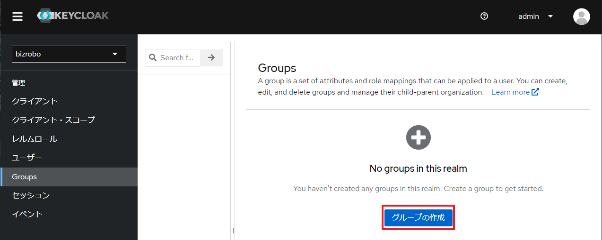
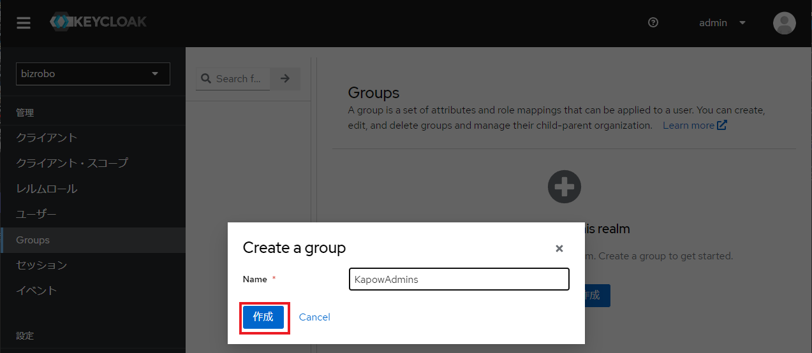
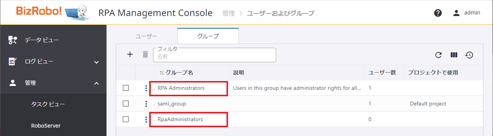
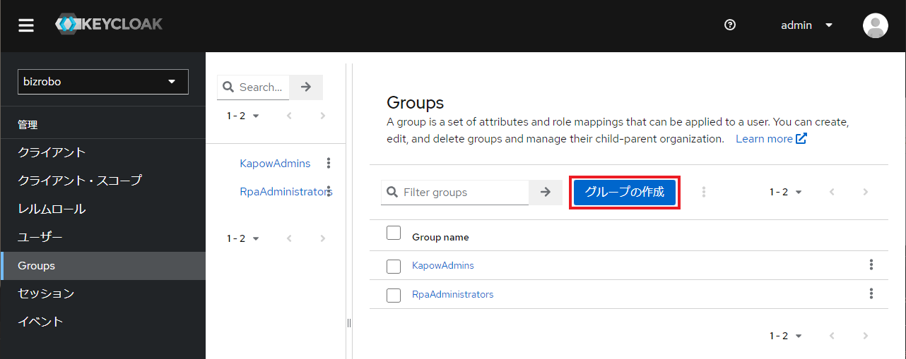
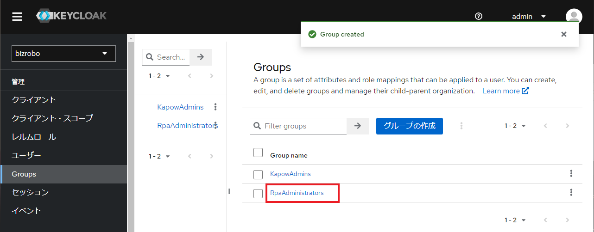
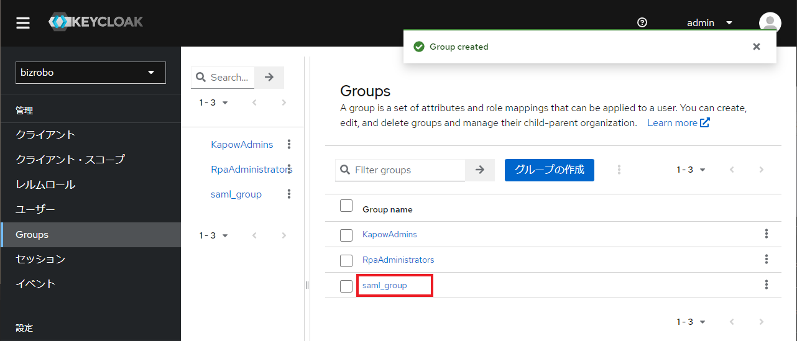

# Groups の設定

以下では、SAML 連携用グループを Keycloak に登録していきます。

Keycloak で Groups を登録する前提として、既に同グループが Management Console に登録されていることに加え、特定のプロジェクトにアサインされている必要があります。

[グループの事前設定](create-mc-group.md)が未実施の方は先に Management Console の設定を実施してください。

## admin グループの作成

> このグループは事前に Management Console へ登録する必要はありません。

`admin` とは Management Console にデフォルトで設定されているスーパーユーザであり、Management Console に対するすべての作業を実行可能です。

SAML 連携においては `saml.xml` 中に `adminGroups` として設定されており、デフォルトのグループ名は `KapowAdmins` です。

1.  サイドメニューから `Groups` を選択し `グループの作成` ボタンをクリックします。
    

2.  グループ名に `KapowAdmins` を入力し、`作成` をクリックする。
    

## 管理者グループの作成

> このグループは事前に Management Console へ登録する必要はありません。

`管理者` とは、Management Console にデフォルトで設定されている管理者ユーザであり、`RPA Administrators` というグループ名で登録されています。

SAML 連携においては `saml.xml` 中に `administratorGroups` として設定されており、デフォルトのグループ名は `RpaAdministrators` です。

> [!NOTE] 管理者グループの名称設定について
> 
>    本手順書では `saml.xml` の設定に合わせて `RpaAdministrators` でグループ登録しますが、Management Console に登録済みの `RPA Administrators` という名称でグループを作成しても構いません。

1.  `グループの作成` をクリックします。
    

2.  グループ名に `RpaAdministrators` を入力し、`作成` をクリックする。

3.  以下の通りグループが作成されたことを確認します。
    

## ユーザーグループの作成

`ユーザーグループ` とは、Management Console 内のプロジェクトに所属するユーザーをアサインするグループであり、登録したグループは 1 つ以上のプロジェクトに所属させることで有効化されます。

SAML 連携においては `saml.xml` 中に `groupsAttributes` として設定されており、対象のグループ名は [MC の設定](configure-mc.md) にてマッピング項目名を定義しています。

1.  `グループの作成` をクリックします。
    

2.  Management Console で作成したグループ名（`saml_group`）を入力し、`作成` をクリックします。

3.  以下の通りグループが作成されたことを確認します。
    
