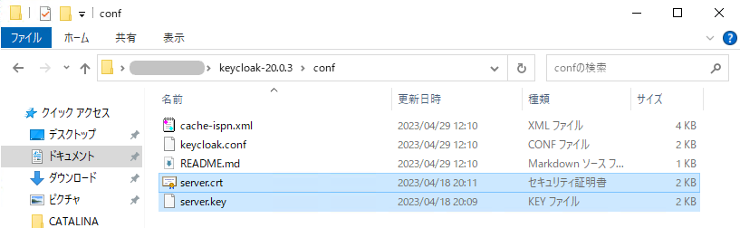
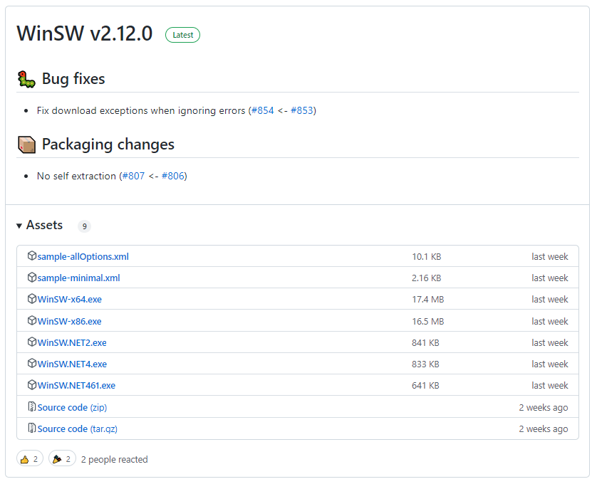

# Keycloak の環境構築

本手順書では `Keycloak v20.0.3` を用いて環境構築を実施します。

## Keycloak のダウンロードと展開

1.  [GitHub の該当ページ](https://github.com/keycloak/keycloak/releases/tag/20.0.3) より Keycloak 20.0.3 をダウンロードします。以下のリンクより直接 .zip ファイルをダウンロードしてください。
    - [keycloak-20.0.3.zip](https://github.com/keycloak/keycloak/releases/download/20.0.3/keycloak-20.0.3.zip)

2.  ダウンロードした zip ファイルを以下に展開します。

**コピーして貼り付け**
```bash
%USERPROFILE%
```

> [!NOTE] 本番環境構築時の展開場所
>
> 本手順書においては利用者のアカウント権限による差異を回避するためにユーザープロファイル直下に環境を構築しますが、本番環境を構築する際には適宜適切な場所を選択ください。

## Keycloak のフォルダ構成

展開したファイルが以下の構成になっていることを確認します。

**Keycloakのフォルダ構成概略**
```porwershell
📂 keycloak-20.0.3
 ├─📂 bin               # Keycloakサーバーの起動スクリプト用ディレクトリ
 │  │  kc.bat
 │  │  kc.sh
 │  │  kcadm.bat
 │  │  kcadm.sh
 │  │  kcreg.bat
 │  │  kcreg.sh
 │  └─📂 client         # KeycloakのJavaクライアントAPI用ディレクトリ
 ├─📂 conf
 │      cache-ispn.xml  # Keycloakのクラスタ構成ファイル
 │      keycloak.conf   # Keycloakサーバーの設定ファイル
 ├─📂 lib               # Keycloakに必要なライブラリ用ディレクトリ
 ├─📂 providers
 └─📂 themes
```

本手順書の内容に関連するもののみピックアップ

## SSL 証明書の配置

1.  `サーバの秘密鍵`、`SSL証明書`を以下のフォルダ内に配置します。

**コピーして貼り付け**
```bash
%USERPROFILE%\keycloak-20.0.3\conf
```

- **server.key**：サーバの秘密鍵
- **server.crt**：SSL 証明書



## 設定ファイルの変更

設定項目はデフォルトで全てコメントアウトされています。それぞれコメントアウトを外した後、適切な値に修正を行ってください。

> [!NOTE] DB の設定について
> 
> デフォルトでは PostgreSQL が指定されておりますが、本書では MySQL を DB として利用します。
またユーザー名、パスワードは「[データベースの作成](create-db.md)」の情報を採用しています。

1.  `conf` フォルダ配下の `keycloak.conf` をテキストエディタ開き、以下を参考に修正します。

    - データベースの接続設定：
	    `db`、`db-username`、`db-password`、`db-url`
    - SSL 通信用設定：`https-certificate-file`、`https-certificate-key-file`
    - ホスト名設定：`hostname`

**keycloak.conf**
```diff
# Basic settings for running in production. Change accordingly before deploying the server.

# Database

# The database vendor.
#db=postgres
+ db=mysql

# The username of the database user.
- #db-username=keycloak
+ db-username=keycloak

# The password of the database user.
- #db-password=password
+ db-password=password

# The full database JDBC URL. If not provided, a default URL is set based on the selected database vendor.
#db-url=jdbc:postgresql://localhost/keycloak
+ db-url=jdbc:mysql://localhost:3306/keycloak

# Observability

# If the server should expose healthcheck endpoints.
#health-enabled=true

# If the server should expose metrics endpoints.
#metrics-enabled=true

# HTTP

# The file path to a server certificate or certificate chain in PEM format.
- #https-certificate-file=${kc.home.dir}conf/server.crt.pem
+ https-certificate-file=${kc.home.dir}/conf/server.crt

# The file path to a private key in PEM format.
- #https-certificate-key-file=${kc.home.dir}conf/server.key.pem
+ https-certificate-key-file=${kc.home.dir}/conf/server.key

# The proxy address forwarding mode if the server is behind a reverse proxy.
- #proxy=reencrypt
+ proxy=reencrypt

# Do not attach route to cookies and rely on the session affinity capabilities from reverse proxy
#spi-sticky-session-encoder-infinispan-should-attach-route=false

# Hostname for the Keycloak server.
- #hostname=myhostname
+ hostname=localhost:8443
```

> [!NOTE] 証明書のパス設定
>
>デフォルトの `keycloak.conf` に書かれている `server.crt` と `server.key` のファイルパスが間違っていることがあります。
> 後続の `bin\kc.bat start` 実行時に `java.nio.file.NoSuchFileException` が出力される際には設定値の見直しを実施してください。

## Keycloak の実行

1.  以下のフォルダに移動して Powershell を起動します。

**コピーして貼り付け**
```bash
%USERPROFILE%\keycloak-20.0.3
```

2.  ビルドコマンドを実行します。

**PowerShellで実行**
```powershell
bin/kc.bat build
```

以下の様に表示され、エラーが発生しなければ OK です。
```powershell
PS C:\Users\…\keycloak-20.0.3> bin/kc.bat build
Updating the configuration and installing your custom providers, if any. Please wait.
2023-04-29 12:43:17,809 INFO  [io.quarkus.deployment.QuarkusAugmentor] (main) Quarkus augmentation completed in 15171ms
Server configuration updated and persisted. Run the following command to review the configuration:

	kc.bat show-config
```

> [!INFORMATION] UnsupportedClassVersionError が出る場合
>
>複数の原因が考えられるため自環境で行った対処のみ紹介します。
> - JRE8 をインストールしている場合は、アンインストールする。
>- java -version を実行し、java 11 が適用されていることを確認する。


3.  Keycloak を起動します。

**PowerShellで実行**
```powershell
bin/kc.bat start
```

以下の様に表示され、エラーが発生しなければ OK です。

```powershell linenums="1"
：
2023-04-29 12:49:17,207 INFO  [org.keycloak.services] (main) KC-SERVICES0050: Initializing master realm                                                                tgresql, keycloak, logging-gelf, n
2023-04-29 12:49:20,790 INFO  [io.quarkus] (main) Keycloak 20.0.3 on JVM (powered by Quarkus 2.13.6.Final) started in 42.991s. Listening on: https://0.0.0.0:8443
2023-04-29 12:49:20,792 INFO  [io.quarkus] (main) Profile prod activated.
2023-04-29 12:49:20,792 INFO  [io.quarkus] (main) Installed features: [agroal, cdi, hibernate-orm, jdbc-h2, jdbc-mariadb, jdbc-mssql, jdbc-mysql, jdbc-oracle, jdbc-postgresql, keycloak, logging-gelf, narayana-jta, reactive-routes, resteasy, resteasy-jackson, smallrye-context-propagation, smallrye-health, smallrye-metrics, vault, vertx]
```

4.  `https://${ローカル端末のIPアドレス}:8443` にアクセスできることを確認する。
    - [https://localhost:8443](https://localhost:8443)

5.  「ctrl」+「C」 で Keycloak を停止

## Keycloak のサービス登録

WinSW を利用して Keycloak をサービス化する方法を以下に記載。

1.  `https://github.com/winsw/winsw/releases`から WinSW.NET461.exe をダウンロードします。
    
2.  ダウンロードした exe ファイルを`keycloak-20.0.3`ディレクトリに移動します。
3.  exe ファイルの名前を`Keycloak.exe`に変更します。
4.  `keycloak-20.0.3`ディレクトリに`Keycloak.xml`ファイルを以下の内容で作成します。
**Keycloak.xml**
```xml
<service>
	<id>Keycloak</id>
	<name>Keycloak</name>
	<description>Keycloak</description>
	<workingdirectory>${keycloakディレクトリの配置パス}</workingdirectory>
	<executable>${keycloakディレクトリの配置パス}\bin\kc.bat</executable>
	<arguments>start</arguments>
	<logmode>rotate</logmode>
</service>
```

5.  管理者権限で PowerShell を開きます。
6.  `keycloak-20.0.3`ディレクトリへ移動します。
7.  以下のコマンドを実行します。

**PowerShellで実行**
```powershell
Keycloak.exe install
```

以下の表示となれば OK です。
```powershell linenums="2" title="PowerShellの実行結果"
2023-02-06 16:41:47,827 INFO  - Installing service 'Keycloak (Keycloak)'...
2023-02-06 16:41:47,919 INFO  - Service 'Keycloak (Keycloak)' was installed successfully.
```

8.  サービスを開き、`Keycloak`サービスが登録されていることを確認します。
    

9.  Keycloak サービスを右クリック後、開始で Keycloak を開始します。
