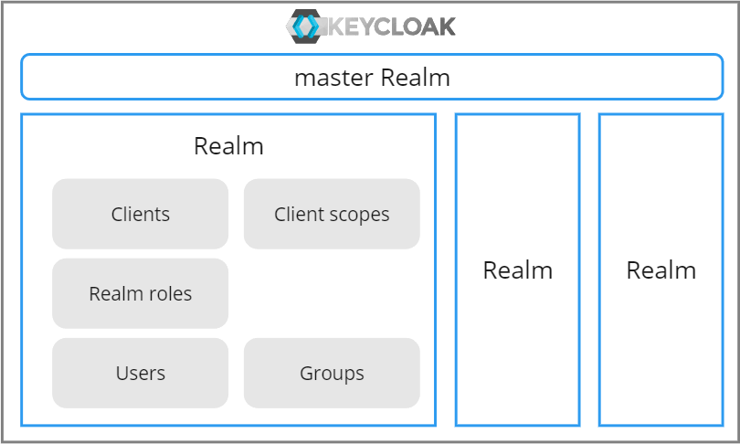
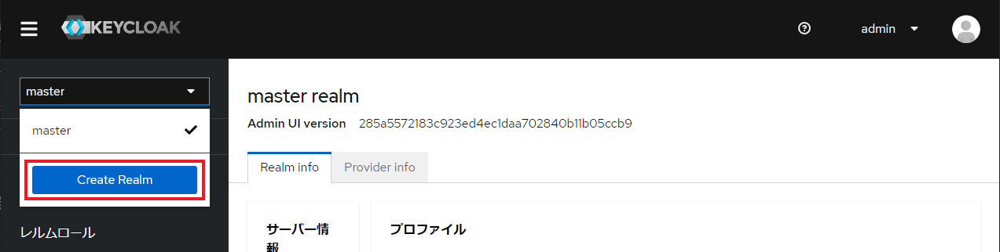
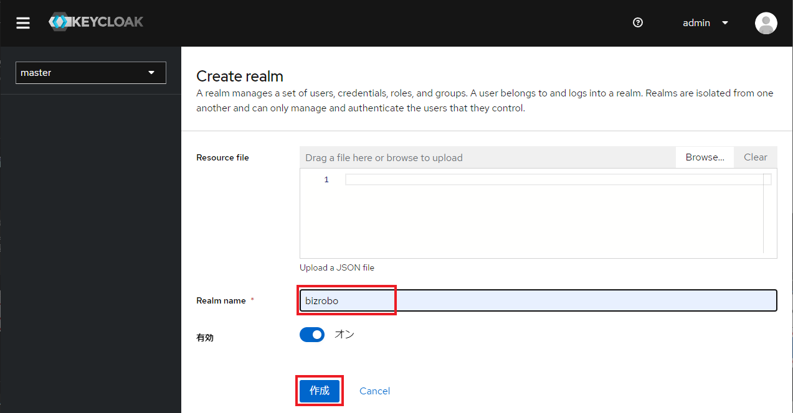
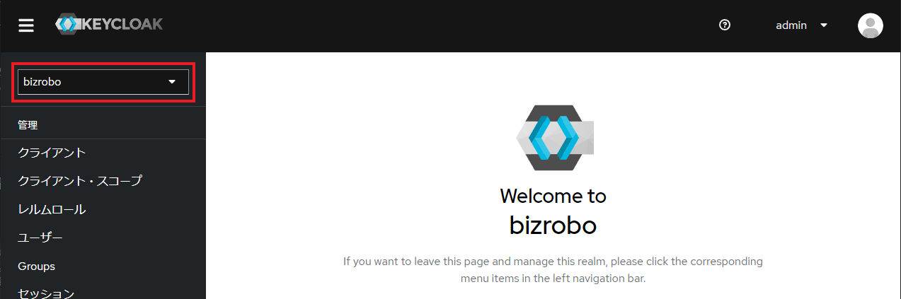
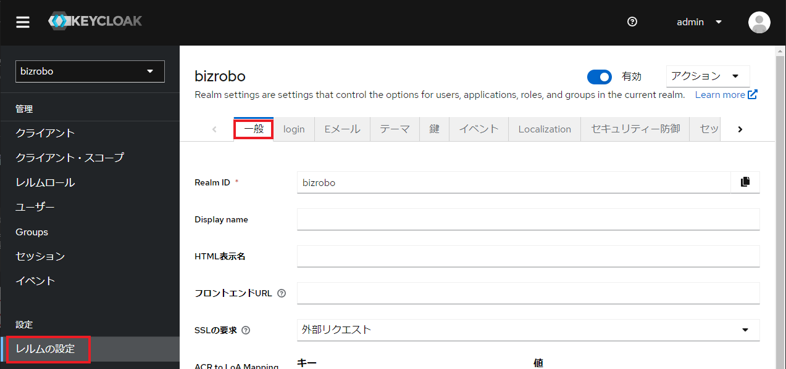
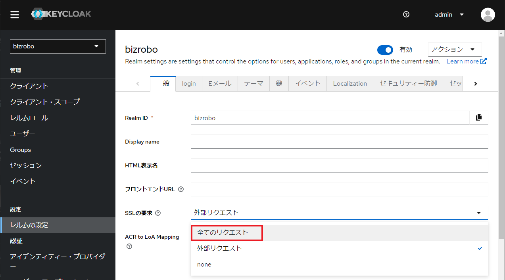
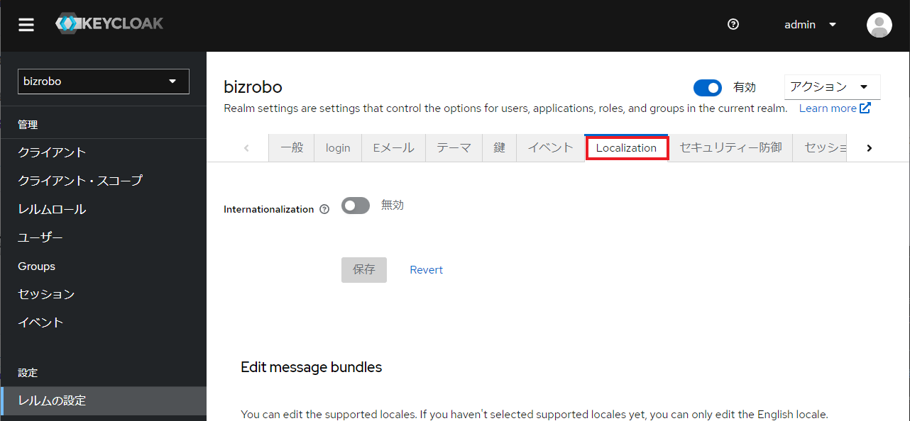
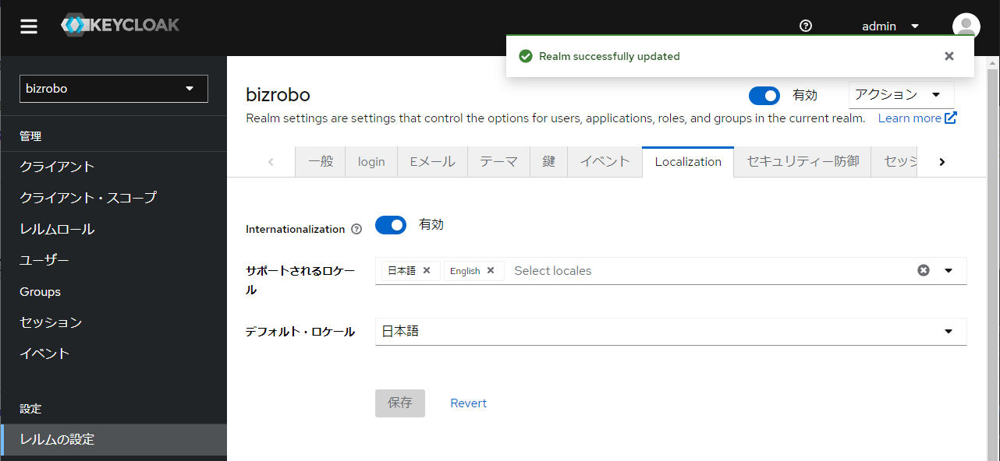

# レルムの作成
## レルム とは

レルム は、ユーザー、クレデンシャル、ロール、およびグループのセットを管理します。

ユーザーは レルム に所属し レルム にログインします。レルム は互いに隔離され、自分が管理するユーザーのみを管理および認証することができます。

`master レルム`

: Keycloak 自体を管理するためのもので、レルム の作成とそれらの レルム に Client やユーザーを追加して、アプリケーションのセキュリティを管理します

`その他の レルム`

: 各アプリケーションの独自のセキュリティ構成を持つため、そのアプリケーションの管理者のみがアクセスできます。他の レルム は、master レルム を親として、それらの設定や構成情報を継承することができます。

## レルム の作成

1.  サイドバー上部のドロップダウンリストを選択し、`Create Realm` ボタンをクリックします。

    

    ***

1.  `Reaml name`に`bizrobo`を入力し、`作成`をクリックする。

    

    | 項目       | 値      |
    | ---------- | ------- |
    | Reaml name | bizrobo |

    ***

1.  現在の レルム が bizrobo になっていることを確認します。

    

## レルム の設定

### SSL 要求

非 SSL での接続を許可しない設定を行う。

1.  サイドメニューから `レルムの設定` を選択し `一般` タブを開きます。

    

    ***

1.  `SSLの要求` のドロップダウンから、`全てのリクエスト` を選択します。

    

    ***

1.  ページ下部の `保存` ボタンをクリックして設定を保存します。

### bizrobo レルムの日本語化

1.  サイドメニューから `レルムの設定` を選択し `Localization` タブを開きます。

    

    ***

1.  以下の通り項目を設定し、`保存` ボタンをクリックします。

    

    | 項目                 | 設定     |
    | -------------------- | -------- |
    | Internationalization | Enabled  |
    | Supported locales    | `日本語` |
    | Default locale       | 日本語   |

## パスワード・ポリシーの設定

前項 [Keycloak の初期設定](init-keycloak.md) の `パスワード・ポリシーの設定` を参考
