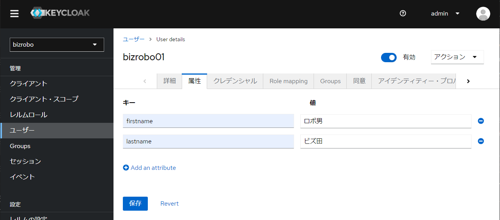

# ユーザーの設定

ManagementConsole ログイン用のユーザーの作成手順を以下に記載。  
本手順で作成したユーザーで SAML 認証ログインをした際に、MangementConsole へユーザーが登録される。

## ユーザー設定

### ユーザーの作成

1.  サイドメニューから `ユーザー` ページを開き、`Create new user` をクリックします。
    

2.  Management Console にログインするためのユーザを作成するために、`ユーザー名`、 `Eメール` を入力し、`Eメールが確認済み` を ON にします。
    

> [!NOTE] `名`と`姓`の位置づけ
> 
> このページで設定する `名` と `姓` は レルム の中で管理されるユーザーの情報であり、個別のクライアントと紐づけるための情報ではありません。

3.  `Join Groups` をクリックし、割り当てたいグループを選択し、`参加` をクリックします。
    
    - 管理者の場合は `KapowAdmins` を追加します。

4.  `作成` をクリックし、ユーザーを作成します。
    

### SP 連係属性の設定

1.  `属性` タブを開く。
    

2.  以下の Key、Value を設定する。

| Key       | Value                       |
| --------- | --------------------------- |
| firstname | MC に連携したいユーザーの姓 |
| lastname  | MC に連携したいユーザーの名 |

> [!NOTE] MC との連携
> 
> 属性に設定した `firstname` と `lastname` は MC に連携され、`lastname firstname` という形式で MC ユーザーの `フルネーム` として登録されます。
> 
> **入力可能な文字種については `saml.xml` に設定した MC の制限に従います（英数字＋かな＋スペース）。それ以外の文字を使って Keycloak 上で登録することは可能ですが、MCログイン時に連携先のMCにてログインエラーとなります。**
>
>＜Keycloak 設定例＞
> 
>
> ＜MC 連携例＞
> 

3.  `保存` をクリックする。

### パスワードの設定

1.  `クレデンシャル` タブを開き、`パスワードを設定` をクリックします。
    

2.  `パスワード`、`新しいパスワード` を入力し、`保存` > `Save password` をクリックしてダイアログを閉じます。
    

> [!NOTE] 一時的パスワード設定による影響
> 
> `一時的` が `On` の場合、以下の様に初回ログイン時にパスワードの変更を求められます。固定パスワードを利用したい場合には `Off` にすることが可能です。
> 
> 
> 
> 初回ログイン時にパスワードを変更した場合、その情報がうまくSAML連携されず以下のようなエラーとなりますが、ログイン自体は完了しておりますので、URLから `/login.jsp` 以降を削除して再度URLを読み込んでください。
> 
> 

3.  以下の通りパスワード情報が生成されます。
    

<!--
### ロール削除

不要なロールマッピングにより不具合が起きることを避けるため削除します。

1.  `Role mapping` タブを開き、`default-roles-bizrobo` にチェックを入れます。

    

1.  `Unassign` > `削除` をクリックし、不要なロールを削除します。

    

-->

## Management Console へのログイン確認

Groups、ユーザー の設定が正確に行われていることを確認します。

以下の情報を入力して Management Console へログインしてください。
- ユーザー作成時に指定した `ユーザ名` または `メールアドレス`
- クレデンシャルで設定した `パスワード`

