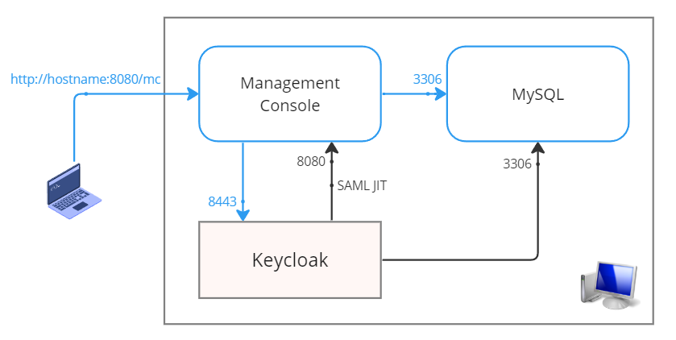

## システム要件

| 項目  | 要件    | 備考  |
| --- | ----- | --- |
| JDK | 11 以上 |     |

| モジュール         | 利用バージョン |
| ------------------ | -------------- |
| Management Console | 11.3.0.2       |
| MySQL Server       | 8.0.31         |
| Keycloak           | 20.0.3         |
| OpenJDK            | 11.0.16.1      |
| OpenSSL            | 3.0.2 15       |

## 構築するシステムの構成

本手順書では Keycloak の設定を以下の構成で実施します。



手順書内の記述も下記の構成を前提とします。SAML の設定を行う各自の環境が以下と異なる場合には適宜実際の状況に読み替えて実施ください。

| 項目            | 値                       |
| --------------- | ------------------------ |
| MC の URL       | http://localhost:8080/mc |
| Keycloak の URL | https://localhost:8443   |

## 前提となる Management Console のフォルダ構成

Tomcat 上で動作する Management Console を前提とし、Tomcat のインストールフォルダは任意とします。
以下、本手順書で扱う Web アプリケーションフォルダ（ `webapps` ）配下の主だった構成を記載します。

**Management Consoleのフォルダ構成概略:**
```
📂 webapps
 └─📂 mc                  # Management Console アプリケーションディレクトリ
    ├─📂 META-INF
    ├─📂 resources
    └─📂 WEB-INF
       |  login.xml        # SAML の有効/無効を設定するファイル
       ├─📂 spring
       |  └─ saml.xml      # SAML の設定を記述するファイル
       ├─📂 classes
       |  └─ 📂 security   # IdP のメタデータを配置するディレクトリ
       |      └─ (idp.xml)
       :
```

## Keycloak の起動モード

Keycloak の起動モードには、`dev` と `prod` の 2 種類があり、本番運用時は `prod` モードを選択します。

以下に `dev` と `prod` における構築時の設定の違いについて記載します。

- `dev` モードではリバースプロキシの存在を想定していませんが、`prod` モードではリバースプロキシの存在を想定しているため、後続の `keycloak.conf` において `proxy` の設定を有効化する必要があります。
- リバースプロキシの設定は、`hostname` と `proxy` の 2 種類があり、`hostname` では keycloak を公開すホスト名やポート番号を指定[^1]し、`proxy` ではリバースプロキシが使用する暗号化方式を指定します。
- `proxy` の設定値には、`reencrypt`、`edge`、`passthrough` の 3 種類があります。

|設定値|説明|
|---|---|
|  `reencrypt` |リバースプロキシと keycloak の間で暗号化通信を行うことを意味します。|
|  `edge` |リバースプロキシとクライアントの間で暗号化通信を行うことを意味します。|
|  `passthrough` |リバースプロキシが暗号化通信を中継することを意味します。|

[^1]: `hostname` に設定する値はクライアントからみたエンドポイントです。今回の構成ではリバースプロキシを特段設定していないため、Keycloak サーバーと同じ値を設定しますが、仮に AWS に Keycloak を構築し、クライアントからは ALB を経由してアクセスさせる場合などは、ALB の `IP:port` がエンドポイントとして設定される値になります。
