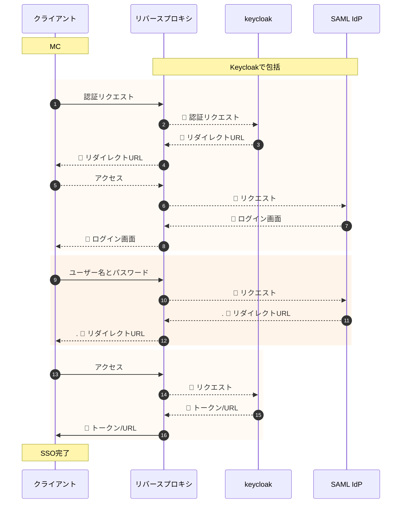

## SAMLによるSSO
### Keycloak の SAML による SSO 処理シーケンス

#### 以下にシーケンス図の詳細をまとめます

1. 認証リクエスト
2. 認証リクエストを転送（HTTPヘッダー付き）
3. SAML IdP にリダイレクトする URL を返す（HTTPヘッダー付き）
4. SAML IdP にリダイレクトする URL を転送（HTTPヘッダー付き）
5. リダイレクトする URL に従って SAML IdP にアクセス
6. SAML IdP に対応するリクエストを転送（HTTPヘッダー付き）
7. ログイン画面を返す（HTTPヘッダー付き）
8. ログイン画面を転送（HTTPヘッダー付き）
9. ログイン画面でユーザー名とパスワードを入力し、SAML IdP に POST する
10. SAML IdP に対応するリクエストを転送（HTTPヘッダー付き）
11. 認証情報が正しい場合、SAML アサーションと keycloak へのリダイレクトする URL を返す（HTTPヘッダー付き）
12. SAML アサーションと keycloak へのリダイレクトする URL を転送（HTTPヘッダー付き）
13. リダイレクトする URL に従って keycloak にアクセス
14. keycloak に対応するリクエストを転送（HTTPヘッダー付き）
15. SAML アサーションからユーザー情報を取得し、アクセストークンとリフレッシュトークンとバックエンドサービスへのリダイレクトする URL を返す（HTTPヘッダー付き）
16. アクセストークンとリフレッシュトークンとバックエンドサービスへのリダイレクトする URL を転送（HTTPヘッダー付き）

リバースプロキシは、keycloakやSAML IdPに対してX-Forwarded-For[^2], X-Forwarded-Proto[^3], X-Forwarded-Port[^4] などのHTTPヘッダーを付与して、クライアントの情報を伝えます。keycloakやSAML IdPは、これらのHTTPヘッダーを読み取って、適切なURLやレスポンスを生成します。

[^2]: X-Forwarded-For : クライアントの IP アドレス
[^3]: X-Forwarded-Proto : クライアントが使っていたプロトコル (HTTP または HTTPS)1
[^4]: X-Forwarded-Port : クライアントが使っていたポート番号

