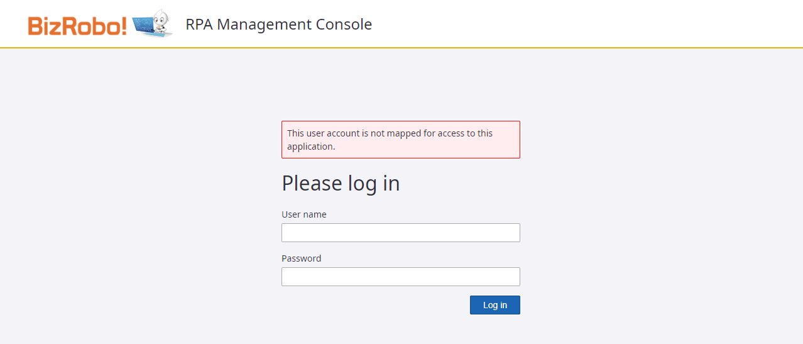

#### `This user account is not mapped for access to this application.` エラーで Management Console にログイン出来ない場合

: 

: Keycloak と Management Console 間でのデータのマッピングが正しく行われていません。一般アカウントの場合、以下の点を確認してください。

- Management Console にSAML連携用のグループが作成されていること。
- SAML連携用のグループが Keycloak にも登録されていること。
- マッピングされたグループが、Management Console でプロジェクトにアサインされていること。

---

#### Management Console からログアウト不可になった場合

: 以下のように Management Console に正常にログインできず、ログアウトもできない場合。

1.  Keycloak にログイン後 bizrobo レルムへ切り替え、サイドバーから `セッション` を選択します。
2.  対象のユーザーの右側メニューから `サインアウト` をクリックし、セッションを削除します。
	
3.  Management Console へアクセスし、Keycloak のログイン画面が表示されることを確認してください。

---

#### しばしば Management Console からのログアウトやユーザーを切り替えてのログインにおいて Management Console ログイン画面にリダイレクトされてエラーが発生します。

: 対応方法は調査中ですが、多くの場合は Keycloak と MC 間のリダイレクト処理の不整合が原因のため、再度初期画面の URL（`http://localhost:8080/mc` など）にアクセスすることにより正常に動作します。
