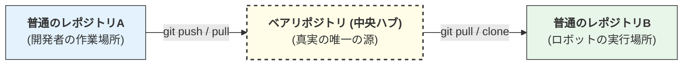
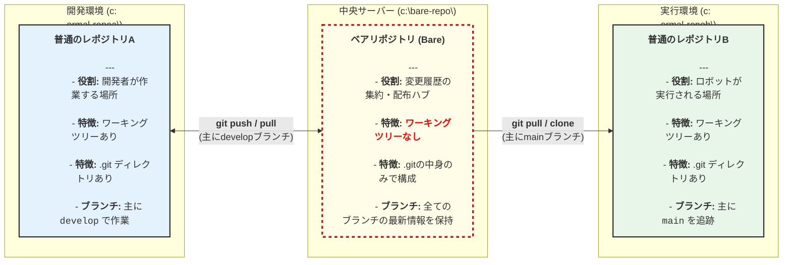

-  `Bare Git Repository` はオブジェクトのバッティングを防ぐために `Management Console` のプロジェクトごとに生成することを推奨します。[^4]
- 小規模環境で、`Management Console` を 開発用/本番用 で兼用する場合、`Synchronizer` も 開発用/本番用 を兼用する構成になります。プロジェクトに設定する URL の値は同じ `Bare Git Repository` のURL（ファイルパス）とし、ブランチ名で `開発用＝develop`、`本番用＝prod` と切り分けて下さい。
- `Promotion Manager` 用の `Git 連携ツール` について、ここでは「自社 Git サーバー」を利用しますが、実態は `Bare Git Repository` を作成した端末上に clone したローカルリポジトリ、およびその端末とします。また、プルリクエスト等を管理するサーバー機能は除外します。小規模環境で `Management Console` を構築した端末上に合わせて `Synchronizer` も `Bare Git Repository` も構築する場合には、その端末が 自社Gitサーバーの位置づけとなります。


---


[^4]: 複数プロジェクトをまたぎ、Management Consoleで1つの `Bare Git Repository` を共有する場合は ブランチ名により Management Console 内の各プロジェクトを識別することも可能ですが、管理が煩雑になることに加え、ブランチ名が誤って重複してしまった場合、プロジェクト間のオブジェクトを意図せず同期してしまったり、内部でコンフリクトが発生し、RLMの障害、運用の中断が発生します。

---

https://knowledge.tungstenautomation.com/bundle/z-kb-articles-salesforce5/page/22957.html


```bash
C:\Users\oishi>"C:\Program Files\BizRobo Basic 11.5.0.5\bin\Synchronizer.exe" --help
「wrapper.java.additional.100」プロパティは、コンフィギュレーション・ファイルの行番 #6 で再定義されました：C:\Program Files\BizRobo Basic 11.5.0.5\bin\headless.conf
  古い値 wrapper.java.additional.100=-DcompanyName="OPEN, Inc."
  新しい値 wrapper.java.additional.100=-Djava.awt.headless=true
--> Wrapper がコンソールとして開始しました
JVM 起動中…
WrapperManager: Initializing...
usage: Synchronizer
 -c,--command-line               Take settings from command line,
                                 disregard the settings file and
                                 environment.
 -e,--environment                Take settings from environment, disregard
                                 the settings file
 -g,--generate-ssh-keys <arg>    Generate key-pair for ssh authentication
 -h,--help                       Print this help and exit
    --interval <arg>             The interval (in seconds) between each
                                 synchronization attempt (only in
                                 conjunction with the -c option)
    --mc-url <arg>               The URL for the Management Console (only
                                 in conjunction with the -c option)
    --no-host-key <arg>          Disable strict SSH host-key checking
                                 (only in conjunction with the -c option)
    --private-key <arg>          Path to private SSH key to use with SSH
                                 (only in conjunction with the -c option)
 -r,--reset-hard                 Reset all version information and remove
                                 all local cache
 -s,--save                       Store settings into the settings file and
                                 exit
    --shared-secret <arg>        The Synchronizer shared secret for
                                 Management Console (only in conjunction
                                 with the -c option)
    --shared-secret-file <arg>   The Synchronizer shared secret file for
                                 Management Console (only in conjunction
                                 with the -c option)
 -v,--version                    Print version information and exit
<-- Wrapper Stopped
```


### 起動
- 何も設定をしないで実行した場合
```bash
C:\Program Files\BizRobo Basic 11.5.0.5\bin>Synchronizer.exe
--> Wrapper がコンソールとして開始しました
JVM 起動中…
WrapperManager: Initializing...
2025-07-29 14:53:03,267  WARN com.kapowtech.synchronizer.runtime.Settings - [EVENT UNSPECIFIED -> /com.kapowtech.synchronizer.runtime.Settings] No settings given, falling back on defaults (use -h to for help)
2025-07-29 14:53:03,271  INFO com.kapowtech.synchronizer.runtime.Settings - [EVENT UNSPECIFIED -> /com.kapowtech.synchronizer.runtime.Settings] Set mc_url = http://localhost:8080/ManagementConsole
2025-07-29 14:53:03,271  INFO com.kapowtech.synchronizer.runtime.Settings - [EVENT UNSPECIFIED -> /com.kapowtech.synchronizer.runtime.Settings] Set shared_secret = null
2025-07-29 14:53:03,271  INFO com.kapowtech.synchronizer.runtime.Settings - [EVENT UNSPECIFIED -> /com.kapowtech.synchronizer.runtime.Settings] Set shared_secret_file = null
2025-07-29 14:53:03,272  INFO com.kapowtech.synchronizer.runtime.Settings - [EVENT UNSPECIFIED -> /com.kapowtech.synchronizer.runtime.Settings] Set interval = 3
2025-07-29 14:53:03,272  INFO com.kapowtech.synchronizer.runtime.Settings - [EVENT UNSPECIFIED -> /com.kapowtech.synchronizer.runtime.Settings] Set private_key = C:\Users\oishi\.ssh\id_rsa
2025-07-29 14:53:03,272  INFO com.kapowtech.synchronizer.runtime.Settings - [EVENT UNSPECIFIED -> /com.kapowtech.synchronizer.runtime.Settings] Set no_host_key = false
2025-07-29 14:53:03,272 ERROR com.kapowtech.synchronizer.runtime.Settings - [EVENT UNSPECIFIED -> /com.kapowtech.synchronizer.runtime.Settings] shared_secret or shared_secret_file is missing in default values
<-- Wrapper Stopped
```

**実行内容**
1. 設定有無確認（パラメータ/環境変数/synchronizer.settings）
2. デフォルト値の割り当て起動
3. 必須項目不足によるエラー停止

> [!NOTICE]
> 必須項目が設定されていないと結局シャットダウンされるのに、なぜデフォルト値を設定？
> （デフォルト設定される値はすべて必須項目のため、デフォルト値が活用されることはない。。）

> [!QUESTION]
> - パラメータの設定方法についてはドキュメントあり。
> - 環境変数への設定はDocker環境を想定したIFであり、今回は考慮しない。
> - `synchronizer.settings`への設定方法はパラメータ設定の内容を `-s` で保存。ただ、バイナリ形式なのか、設定状況の確認ができない。（仕様）


### パラメータを設定して実行
```bash
C:\Program Files\BizRobo Basic 11.5.0.5\bin>Synchronizer.exe -c ^
  --mc-url http://localhost:8070 ^
  --shared-secret fOLLg7xesxG5WRELsAZP83ts5-KZCmat-WeuKz5NBBqwEmdDVzoGU0cIZN3mpsdI1Jn5x9O51gLAVzQH6JrdGg ^
  --interval 10 --no-host-key true ^
  --private-key p:\dummy
```

> [!QUESTION]
> 現行仕様ではフォーマット上 `--private-key` が必要ですが、実在にかかわらずパス形式で指定されていればOK。
> 上の例ではドライブもフォルダも存在しない値（`p:\dummy`）を指定していますが、ローカル環境のみの運用の場合、問題ありません。
> よくある設定値としては `%USERPROFILE%\.ssh\id_rsa`

![[Pasted image 20250729160825.png]]
```bash
C:\Program Files\BizRobo Basic 11.5.0.5\bin>Synchronizer.exe -c ^
More?   --mc-url http://localhost:8070 ^
More?   --shared-secret fOLLg7xesxG5WRELsAZP83ts5-KZCmat-WeuKz5NBBqwEmdDVzoGU0cIZN3mpsdI1Jn5x9O51gLAVzQH6JrdGg ^
More?   --interval 10 --no-host-key true ^
More?   --private-key p:\dummy
「wrapper.java.additional.100」プロパティは、コンフィギュレーション・ファイルの行番 #6 で再定義されました：C:\Program Files\BizRobo Basic 11.5.0.5\bin\headless.conf
  古い値 wrapper.java.additional.100=-DcompanyName="OPEN, Inc."
  新しい値 wrapper.java.additional.100=-Djava.awt.headless=true
--> Wrapper がコンソールとして開始しました
JVM 起動中…
WrapperManager: Initializing...
2025-07-30 17:45:30,464  INFO com.kapowtech.synchronizer.Main - [EVENT UNSPECIFIED -> /com.kapowtech.synchronizer.Main] started Synchronizer for http://localhost:8070 with a poll interval of 10s
2025-07-30 17:45:31,346  INFO com.kapowtech.synchronizer.Main - [EVENT UNSPECIFIED -> /com.kapowtech.synchronizer.Main] starting the synchronization of pj_ua using com.kapowtech.synchronizer.git.GitSynchronizer
2025-07-30 17:45:31,813  INFO com.kapowtech.synchronizer.git.GitSynchronizer - [EVENT UNSPECIFIED -> /com.kapowtech.synchronizer.git.GitSynchronizer] cloned remote C:\RobotLifecycleManagement into local repository C:\Users\oishi\AppData\Local\Kofax RPA\11.5.0.5_549\Data\Synchronizer\pj_ua_localhost_RobotLifecycleManagement_develop (b47774543aa6e8e97ec90a438428755d8773dad5)
2025-07-30 17:45:32,227  INFO com.kapowtech.synchronizer.Main - [EVENT UNSPECIFIED -> /com.kapowtech.synchronizer.Main] Missing unknown 17f5107aaf9041f927f2e0bf7710caf2f6181269. About to reset pj_ua and to try once more.
2025-07-30 17:45:32,453  INFO com.kapowtech.synchronizer.git.GitSynchronizer - [EVENT UNSPECIFIED -> /com.kapowtech.synchronizer.git.GitSynchronizer] cloned remote C:\RobotLifecycleManagement into local repository C:\Users\oishi\AppData\Local\Kofax RPA\11.5.0.5_549\Data\Synchronizer\pj_ua_localhost_RobotLifecycleManagement_develop (b47774543aa6e8e97ec90a438428755d8773dad5)
2025-07-30 17:45:32,933  INFO com.kapowtech.synchronizer.Main - [EVENT UNSPECIFIED -> /com.kapowtech.synchronizer.Main] done synchronizing pj_ua 8f95476d370e537e8d1896aa091d73adfbf8e46d
2025-07-30 17:45:32,934  INFO com.kapowtech.synchronizer.Main - [EVENT UNSPECIFIED -> /com.kapowtech.synchronizer.Main] starting the synchronization of pj_ua_prod using com.kapowtech.synchronizer.git.GitSynchronizer
2025-07-30 17:45:33,042  INFO com.kapowtech.synchronizer.git.GitSynchronizer - [EVENT UNSPECIFIED -> /com.kapowtech.synchronizer.git.GitSynchronizer] cloned remote C:\RobotLifecycleManagement into local repository C:\Users\oishi\AppData\Local\Kofax RPA\11.5.0.5_549\Data\Synchronizer\pj_ua_prod_localhost_RobotLifecycleManagement_prod (b47774543aa6e8e97ec90a438428755d8773dad5)
2025-07-30 17:45:33,056  INFO com.kapowtech.synchronizer.Main - [EVENT UNSPECIFIED -> /com.kapowtech.synchronizer.Main] Missing unknown b814041f7cd7a6fcae380650cd154846735f508b. About to reset pj_ua_prod and to try once more.
2025-07-30 17:45:33,193  INFO com.kapowtech.synchronizer.git.GitSynchronizer - [EVENT UNSPECIFIED -> /com.kapowtech.synchronizer.git.GitSynchronizer] cloned remote C:\RobotLifecycleManagement into local repository C:\Users\oishi\AppData\Local\Kofax RPA\11.5.0.5_549\Data\Synchronizer\pj_ua_prod_localhost_RobotLifecycleManagement_prod (b47774543aa6e8e97ec90a438428755d8773dad5)
2025-07-30 17:45:33,243  INFO com.kapowtech.synchronizer.Main - [EVENT UNSPECIFIED -> /com.kapowtech.synchronizer.Main] done synchronizing pj_ua_prod b47774543aa6e8e97ec90a438428755d8773dad5
2025-07-30 17:45:43,288  INFO com.kapowtech.synchronizer.Main - [EVENT UNSPECIFIED -> /com.kapowtech.synchronizer.Main] starting the synchronization of pj_ua using com.kapowtech.synchronizer.git.GitSynchronizer
2025-07-30 17:45:43,390  INFO com.kapowtech.synchronizer.Main - [EVENT UNSPECIFIED -> /com.kapowtech.synchronizer.Main] done synchronizing pj_ua 8f95476d370e537e8d1896aa091d73adfbf8e46d
2025-07-30 17:45:43,391  INFO com.kapowtech.synchronizer.Main - [EVENT UNSPECIFIED -> /com.kapowtech.synchronizer.Main] starting the synchronization of pj_ua_prod using com.kapowtech.synchronizer.git.GitSynchronizer
2025-07-30 17:45:43,445  INFO com.kapowtech.synchronizer.Main - [EVENT UNSPECIFIED -> /com.kapowtech.synchronizer.Main] done synchronizing pj_ua_prod b47774543aa6e8e97ec90a438428755d8773dad5
2025-07-30 17:45:53,485  INFO com.kapowtech.synchronizer.Main - [EVENT UNSPECIFIED -> /com.kapowtech.synchronizer.Main] starting the synchronization of pj_ua using com.kapowtech.synchronizer.git.GitSynchronizer
2025-07-30 17:45:53,569  INFO com.kapowtech.synchronizer.Main - [EVENT UNSPECIFIED -> /com.kapowtech.synchronizer.Main] done synchronizing pj_ua 8f95476d370e537e8d1896aa091d73adfbf8e46d
2025-07-30 17:45:53,569  INFO com.kapowtech.synchronizer.Main - [EVENT UNSPECIFIED -> /com.kapowtech.synchronizer.Main] starting the synchronization of pj_ua_prod using com.kapowtech.synchronizer.git.GitSynchronizer
2025-07-30 17:45:53,627  INFO com.kapowtech.synchronizer.Main - [EVENT UNSPECIFIED -> /com.kapowtech.synchronizer.Main] done synchronizing pj_ua_prod b47774543aa6e8e97ec90a438428755d8773dad5
2025-07-30 17:46:03,675  INFO com.kapowtech.synchronizer.Main - [EVENT UNSPECIFIED -> /com.kapowtech.synchronizer.Main] starting the synchronization of pj_ua using com.kapowtech.synchronizer.git.GitSynchronizer
2025-07-30 17:46:03,774  INFO com.kapowtech.synchronizer.Main - [EVENT UNSPECIFIED -> /com.kapowtech.synchronizer.Main] done synchronizing pj_ua 8f95476d370e537e8d1896aa091d73adfbf8e46d
2025-07-30 17:46:03,774  INFO com.kapowtech.synchronizer.Main - [EVENT UNSPECIFIED -> /com.kapowtech.synchronizer.Main] starting the synchronization of pj_ua_prod using com.kapowtech.synchronizer.git.GitSynchronizer
2025-07-30 17:46:03,833  INFO com.kapowtech.synchronizer.Main - [EVENT UNSPECIFIED -> /com.kapowtech.synchronizer.Main] done synchronizing pj_ua_prod b47774543aa6e8e97ec90a438428755d8773dad5
CTRL-C トラップされました。シャットダウン中。
CTRL-C トラップされました。即時のシャットダウンを強制中。
JVM はリクエストに応じて終了しませんでした、中止をします。
JVM はリクエストに応じて中止しました。
<-- Wrapper Stopped
```

**実行内容**
1. パラメータ条件に沿って Synchronizer 起動
	- http://localhost:8070 の MC に対して 10秒間隔で監視
2. MC内の設定に沿って監視開始（Synchronizerが有効化されているプロジェクトに対して監視実行）
	- プロジェクト `pj_ua` のGitとの同期開始
	- プロジェクトで設定した `URL/パス` にベア リポジトリ作成
	- 作成したローカルリポジトリにプロジェクトで設定したブランチ（`develop`）を作成
3. ベア リポジトリをSynchronizer実行ユーザーのアプリケーションデータフォルダ内にクローンして個別のローカルリポジトリを作成
	- `%LOCALAPPDATA%\Kofax RPA\11.5.0.5_549\Data\Synchronizer\pj_ua_localhost_RobotLifecycleManagement_develop`
4. 10秒間隔でのリポジトリ監視開始

> [!INFORMATION]
> リポジトリ用のフォルダは事前に作成しておかなくても `MC` のプロジェクトに設定した値をもとに Synchronizer が自動的に作成します。
> クローンしたレポジトリには同期対象のオブジェクトもファイルとして自動生成されます。これは、MCではこれらのオブジェクト情報をDB内に格納していますが、Gitによる更新情報をファイルベースで感知するために複製しているものと思われます。


### サービスとしての Synchronizer の実⾏[^1]
[^1]: Tungsten RPA 2025.2 管理者ガイド P89

Tungsten RPASynchronizer により、Management Console と使⽤しているリポジトリとの間でオブ ジェクトの状態が⽐較および同期されます。Synchronizer の詳細については、『Tungsten RPA のヘル プ』の「ロボット ライフサイクル マネジメント」を参照してください。 このトピックでは、Synchronizer を Windows サービスとして開始する例を⽰します。

#### Windows サービスの追加 
Synchronizer をサービスとしてインストールする例を以下に⽰します。ServiceInstaller.exe につ いては、「ServiceInstaller.exe の説明」を参照してください。 
1. コマンド プロンプト ウィンドウで、Synchronizer を実⾏するために必要なパラメータを指定しま す。詳細については、『Tungsten RPA のヘルプ』の「同期の開始」を参照してください。 
	> 構成設定はコマンドを実⾏するユーザーの AppData に保存されるため、コマンド ラインは Synchronizer サービスを実⾏するユーザーとして実⾏する必要があります。 
2. Synchronizer が正しく動作することを確認し、コマンド ラインで -s パラメータを使⽤して構成設 定を保存します。 
3. 次のスクリプトを使⽤して、Synchronizer サービスをインストールします。 

```bash
ServiceInstaller.exe -i Synchronizer.conf wrapper.ntservice.account=domain \account wrapper.ntservice.password.prompt=true wrapper.ntservice.name="Synchronizer2025.2_MC" wrapper.ntservice.starttype=MANUAL wrapper.syslog.loglevel=INFO
```
パラメータを変更する必要がある場合は、Synchronizer サービスを停⽌し、新しいパラメータを指定し てコマンド ラインから Synchronizer を実⾏して、新しい構成設定を保存してから、Synchronizer サー ビスを再起動します。 

#### Windows サービスの削除 
サービスをアンインストールするには、次のコマンドを実⾏できます。 
```bash
ServiceInstaller.exe -r Synchronizer.conf wrapper.ntservice.name="Synchronizer2025.2_MC" 
```
`wrapper.ntservice.name` 削除するサービスの名前。


---
---
---
---
revert の手順を失敗してしまい

Git を使い続けているとディスクの容量はどうなる？メンテナンスの方法を知りたい。


---
## Gitの仕組みから見た Robot Lifecycle Management

### はじめに：全体像の把握

まず、ご提示のシナリオにおける登場人物の関係性を図で整理しましょう。これが全ての理解の基礎となります。





この図が、あなたの質問すべてに答えるための鍵となります。RLMは、このGitの基本的な分散型バージョン管理の仕組みを利用して、ロボットのコード（開発版から本番版へ）の昇格・連携を管理しているのです。

---

### 1. RLMにおけるブランチマージとリポジトリ連携の仕組み

> RLMの仕組みとしては、レポジトリAの `develop` ブランチを `main` ブランチにマージすると、レポジトリBの`main` ブランチにファイルが連携されるのですが、これはベアリポジトリと何か関連がありますか？

**回答：はい、密接に、そして決定的に関連しています。ベアリポジトリがなければ、この連携は成り立ちません。**

**【Git全体の動きとRLMの役割】**

1.  **ローカルでのマージ (in レポジトリA):**
    *   開発者は、レポジトリA（`normal-repoa`）で作業をします。
    *   `develop` ブランチの準備が整うと、`main` ブランチに切り替え、`develop` ブランチの変更を取り込みます（`git merge develop`）。
    *   **この時点では、変更はまだレポジトリAの中にしか存在しません。** ベアリポジトリやレポジトリBには何の影響もありません。

2.  **中央へのプッシュ (レポジトリA → ベアリポジトリ):**
    *   開発者が `git push` を実行します。
    *   これにより、レポジトリAのローカルにある `main` ブランチの最新の状態（`develop`とのマージ結果を含む）が、**中央のベアリポジトリ（`c:\bare-repo\`）** に送信されます。
    *   この瞬間、ベアリポジトリの `main` ブランチが更新され、"真実の唯一の源 (Single Source of Truth)" が新しくなりました。

3.  **本番環境へのプル (ベアリポジトリ → レポジトリB):**
    *   レポジトリB（ロボットが実際に稼働する環境などを想定）は、そのままでは古い状態です。
    *   レポジトリBがベアリポジトリから最新の情報を取得するために `git pull` を実行する必要があります。
    *   `git pull` を実行すると、ベアリポジトリにある最新の `main` ブランチの内容がレポジトリBにダウンロードされ、ローカルのファイルが更新されます。

**【結論とRLMの役割】**

レポジトリAとレポジトリBは直接通信していません。すべてのやり取りは **ベアリポジトリ** を経由します。これが「ハブ＆スポーク」モデルと呼ばれる、Gitの最も一般的な協力開発の形態です。

RLMの「連携」機能は、おそらくこの `git push` (Aからベアへ) と `git pull` (Bがベアから) の一連の流れを、GUIのボタンクリックなどで自動化・抽象化しているものと考えられます。ユーザーはGitコマンドを意識せずとも、「開発版を本番に反映する」という操作だけで、裏ではこのGitフローが実行されているのです。

---

### 2. ベアリポジトリの働きと役割

> ベアリポジトリの働きと役割について、今回のケースを使って説明してください。

**回答：ベアリポジトリは、「作業をしない、純粋な歴史の保管庫」であり、「全員の変更を集約し、配布するための中央ハブ」です。**

**【背景と仕組み：なぜベア（裸）なのか？】**

*   **普通のレポジトリ（Non-Bare Repository）:**
    *   私たちが普段 `git clone` してきて作業するリポジトリです。
    *   これには2つの主要な要素があります。
        1.  **ワーキングツリー (Working Tree):** 実際にファイルが見えて、編集できる場所（例: `main.py`, `README.md` など）。
        2.  **.git ディレクトリ:** プロジェクトのヒストリー、ブランチ情報、設定など、Gitの「脳みそ」とも言えるデータベース。これは通常隠しフォルダになっています。

*   **ベアリポジトリ (Bare Repository):**
    *   ワーキングツリーがありません。つまり、**ファイルを直接編集する場所がありません**。
    *   中身は、普通のレポジトリの `.git` ディレクトリの中身とほぼ同じです。ヒストリーと設定情報だけが存在します。

**【今回のケースでの役割】**

もし `c:\bare-repo\` が普通のレポジトリだったらどうなるか考えてみましょう。

開発者がレポジトリAから `push` しようとしたとします。もし中央リポジトリが `main` ブランチをチェックアウト（ワーキングツリーに展開）していたら、Gitは `push` を拒否します。なぜなら、`push` によってワーキングツリーのファイルが勝手に書き換えられてしまうと、もし中央リポジトリで誰かが作業をしていた場合、その作業内容と衝突し、大混乱に陥るからです。

**ベアリポジトリにはワーキングツリーがないため、この問題が起きません。** どのブランチに `push` されても、それは単にヒストリーデータベースが更新されるだけで、誰かの作業を妨害することがないのです。

したがって、ベアリポジトリの役割は以下の通りです。

1.  **安全な Push 先:** 複数人（または複数プロセス、今回のAとBのように）が変更を送信するための、安全で衝突の起きない受け皿となります。
2.  **中央集権的な調整役:** 全員の変更を一度ここに集めることで、誰がいつどんな変更をしたのかを一元管理します。これが「真実の唯一の源」です。
3.  **純粋な共有ハブ:** 作業場ではないため、その役割は「共有」に特化しています。これにより、リポジトリの目的が明確になります。

あなたのRLMの構成では、`c:\bare-repo\` はまさにこの役割を担っており、開発環境(A)と実行環境(B)の間の信頼できる仲介者として機能しています。

---

### 3. リポジトリ初期化コマンド群の解説

> このコマンド群で何を期待して、何をしているのか教えてください。

**【期待する最終状態】**
中央に `bare-repo` があり、それをクローンした `normal-repoa` が存在する。`normal-repoa` には `master` と `develop` の2つのブランチがあり、どちらも中央リポジトリに `push` 済み。現在の作業ブランチは `develop` になっている。

**【コマンドごとの詳細解説】**

```shell
# 1. ベアリポジトリ用のディレクトリ作成
mkdir bare-repo\
cd bare-repo\

# 2. ベアリポジトリの初期化
git init --bare
# => ここで c:\bare-repo\ にワーキングツリーのない、Gitのデータベースが作成されます。
#    ls コマンドなどで中を見ると、HEAD, config, objects, refs といったファイル/ディレクトリが見えます。
#    これがベアリポジトリの本体です。
```

```shell
# 3. 作業用リポジトリの作成（クローン）
cd ..
git clone bare-repo\ normal-repoa
# => "bare-repo" をリモート（=origin）として持つ、ローカルリポジトリ "normal-repoa" を作成します。
#    `git clone` は以下の処理を自動で行います。
#    a. `normal-repoa` ディレクトリを作成
#    b. `git init` を実行して .git ディレクトリを作成
#    c. `git remote add origin c:\bare-repo\` を実行し、リモートリポジトリを登録
#    d. `git fetch` を実行し、リモートの全データをダウンロード
#    e. デフォルトブランチ（この時点ではまだ存在しないが、通常はmaster/main）をチェックアウト
#    ※ `warning: You appear to have cloned an empty repository.` は、ベアリポジトリにまだコミットが一つもないため表示される正常な警告です。
```

```shell
# 4. 最初のコミットを作成
cd normal-repoa\
git commit --allow-empty -m 'initial commit'
# => プロジェクトのヒストリーを開始するための「ルートコミット」を作成します。
#    `--allow-empty` は、ファイルに変更がなくてもコミットを作成できるオプションです。
#    プロジェクトの基点を作るためによく使われます。
```

```shell
# 5. masterブランチを中央リポジトリにpush
git push origin master
# => ローカルの `master` ブランチを `origin` (c:\bare-repo\) に送信します。
#    ※あなたの例の `Everything up-to-date` は少し奇妙です。通常はオブジェクトが書き込まれる旨のメッセージが出ます。
#    おそらく、このコマンドの前に何らかの操作があったか、あるいはGitのバージョンや設定による違いかもしれません。
#    正しくは、このコマンドでベアリポジトリに初めて `master` ブランチが作られます。
```

```shell
# 6. 開発用ブランチの作成と切り替え
git checkout -b develop
# => `develop` という名前の新しいブランチを作成し (`-b`)、そのブランチに移動 (`checkout`) します。
```

```shell
# 7. developブランチを中央リポジトリにpushし、上流ブランチを設定
git push -u origin develop:develop
# => このコマンドは重要なので分解します。
#    - `push`: 送信します
#    - `-u` or `--set-upstream`: 今後の `git pull/push` のために、ローカルの `develop` とリモートの `develop` を紐付けます。これにより、次回から `git push` だけで `origin` の `develop` に push されるようになります。
#    - `origin`: 送信先のリモート名
#    - `develop:develop`: `<ローカルブランチ名>:<リモートブランチ名>` の形式。ローカルの`develop`をリモートの`develop`としてpushする、という意味です。（単に `develop` と書いても通常は同じ意味になります）
```

👉 [[#リポジトリ初期化に関するQ&A]]

---

### 4. マージ（昇格）コマンド群の解説

> このコマンド群で何を期待して、何をしているのか教えてください。

**【期待する最終状態】**
`develop` ブランチで行われた変更が、マージコミットという形で `main` ブランチに統合される。そして、その統合された `main` ブランチが中央リポジトリに `push` される。これにより、他のリポジトリ（例：`normal-repob`）が `pull` すれば、この変更を受け取れる状態になる。

**【コマンドごとの詳細解説】**

```shell
# 1. 作業ディレクトリへ移動
cd normal-repoa\

# 2. 念のため最新のdevelopブランチに切り替え
git checkout develop

# 3. リモートの最新情報を取得（重要！）
git pull
# => マージする前に、他の人が `develop` ブランチを更新している可能性に備え、リモート（ベアリポジトリ）から最新の変更を取得します。
#    `git pull` は `git fetch` (リモートの情報を取ってくる) + `git merge` (ローカルのブランチに統合する) のショートカットです。
#    これを怠ると、古い状態でマージしてしまい、先祖返りやコンフリクトの原因になります。
```

```shell
# 4. マージ先のブランチ（本番ブランチ）に切り替え
git checkout main
# => `develop` の変更を取り込む先のブランチ、つまり `main` に移動します。
```

```shell
# 5. developブランチをmainブランチにマージ
git merge --no-ff develop
# => これが核心部分です。
#    - `git merge develop`: `develop` ブランチのヒストリーを現在のブランチ (`main`) に取り込みます。
#    - `--no-ff`: "No Fast-Forward" の略。これは非常に重要なオプションです。
#      - **Fast-Forward (デフォルトの挙動):** もし `main` ブランチが `develop` が分岐してから一度も更新されていなければ、Gitはただ `main` のポインタを `develop` の最新コミットに移動させるだけです。ヒストリーが一直線になり、マージしたという事実が残りません。
#      - **--no-ff (マージコミットを作成):** 上記の条件でも、必ず「`develop`を`main`にマージしました」という新しいコミット（マージコミット）を作成します。
#      - **RLMにおける `--no-ff` の重要性:** このマージコミットが「開発版を本番に昇格させた」という明確な証拠としてヒストリーに残ります。いつ、誰が、どのバージョンの `develop` を昇格させたのかが一目瞭然となり、監査や問題発生時の原因追跡に極めて有効です。RLMのようなライフサイクル管理では、このオプションはほぼ必須と言えるでしょう。
```

```shell
# 6. マージ結果を中央リポジトリにpush
git push
# => ローカルで更新された `main` ブランチ（マージコミットを含む）を、リモート (`origin` = `c:\bare-repo\`) に送信します。
#    これで、ベアリポジトリの `main` が更新され、レポジトリBが `git pull` すれば変更を受け取れる状態になりました。
```


### 5．戻す方法


---
---
---
---
## リポジトリ初期化に関するQ&A
### Q1. ベアリポジトリの初期化 `git init --bare` 直後、ベアリポジトリにはブランチは何もない状態ですか？

**回答：はい、その通りです。ブランチは一つも存在しません。**

**【背景と仕組み】**
Gitにおける「ブランチ」とは、**特定のコミットを指し示すポインタ（名前付きの付箋のようなもの）**です。

`git init --bare` を実行した直後のベアリポジトリは、完全に空っぽのデータベースです。まだコミットが一つも存在しないため、ポインタが指し示すべき対象がありません。したがって、ブランチも存在し得ないのです。

この状態のリポジトリ内部を覗くと、ブランチ情報が格納されるはずの `.git/refs/heads/` ディレクトリ（ベアリポジトリでは `refs/heads/`）は空っぽです。

---

### Q2. 作業用リポジトリの作成（クローン）`git clone bare-repo\ normal-repoa` 直後、作業用リポジトリにはブランチは何もない状態ですか？

**回答：ほぼその通りですが、より正確には「どのコミットも指していない、名前だけの未来のブランチ（unborn branch）が存在する」状態です。**

**【背景と仕組み】**
`git clone` はリモートリポジトリの状態を忠実にコピーします。今回、クローン元のベアリポジトリにはブランチが一つもありませんでした。そのため、クローン後の `normal-repoa` にも、**実体のあるブランチは一つも作成されません。**

しかし、この状態で `git status` コマンドを打つと、おそらく以下のように表示されます。

```
On branch master

No commits yet

nothing to commit (create/copy files and use "git add" to track)
```

これは一見矛盾しているように見えますが、Gitの親切な設計によるものです。これは「あなたは今、**まだ生まれていない (unborn) `master` ブランチ**にいます。次にコミットをすれば、そのコミットを指す `master` という名前のブランチが正式に誕生しますよ」という状態を示しています。

この時点でも、`normal-repoa/.git/refs/heads/` ディレクトリはまだ空です。

---

### Q3. 最初のコミットはどのブランチで行われますか？ブランチのない状態でコミットすると、特定のブランチが作成されるのでしょうか？

**回答：はい、その通りです！最初のコミットは、現在いる unborn branch (Q2の `master`) で行われ、そのコミットと同時に `master` ブランチが正式に作成されます。**

**【Gitの核心：コミットとブランチの誕生】**
ここが非常に重要なポイントです。

1.  **コミットの実行:** `git commit --allow-empty -m 'initial commit'` が実行されます。
2.  **オブジェクトの作成:** Gitは、このコミットを表す「コミットオブジェクト」をデータベース（`.git/objects/`）内に作成します。このオブジェクトには、作者、日時、メッセージ、そして（今回は空ですが）ファイル構成の情報が含まれ、一意のハッシュ値が与えられます。
3.  **ブランチの誕生:** Gitは、今いる unborn branch の名前（`master`）で、ブランチの実体であるファイルを作成します。具体的には、`.git/refs/heads/master` というファイルを作成し、そのファイルの中に**ステップ2で作成したコミットのハッシュ値を書き込みます。**

つまり、**最初のコミットの実行が、最初のブランチを誕生させる引き金になる**のです。コミットとブランチは、この最初の瞬間において、不可分の関係にあります。

---

### Q4. `master` ブランチはいつ作成されたものでしょうか？

**回答：直前の `git commit --allow-empty -m 'initial commit'` コマンドが実行された、まさにその瞬間に作成されました。**

これはQ3の解説の通りです。`commit` コマンドが、ローカルリポジトリ `normal-repoa` に `master` ブランチを誕生させました。

したがって、`git push origin master` というコマンドは、たった今ローカルに誕生したばかりの `master` ブランチ（とそのブランチが指し示すコミット）を、リモートリポジトリ `origin` に送信する、という意味になります。

---

### Q5. ベアリポジトリに `develop` ブランチは存在しないはずですが、push コマンドには暗黙の `-b`（ブランチの作成）機能があるのでしょうか？

**回答：はい、その通りです！`git push` コマンドには、リモートに存在しないブランチを新規に作成する機能が備わっています。**

**【`push` の本質】**
`git push` の本質的な役割は「**ローカルリポジトリのブランチ（が指し示す状態）を、リモートリポジトリに反映させる**」ことです。

ローカルに `develop` という新しいブランチが存在し、リモートにそれが存在しない場合、「反映させる」という行為は、すなわち「リモートに新しく `develop` ブランチを作成する」ことになります。

ですから、特別な `-b` のようなオプションは不要です。`git push origin develop` と実行するだけで、Gitは以下の動作をします。
1.  リモート `origin` に `develop` というブランチがあるか確認する。
2.  なければ、リモートの `refs/heads/` ディレクトリに `develop` という参照ファイルを作成し、ローカルの `develop` が指しているコミットのハッシュ値を書き込む。
3.  もし既に存在していれば、そのブランチを更新しようとします。

これはGitの非常に直感的でパワフルな機能の一つです。

---

### Q6. `-u` での紐づけがない場合に各種 `push` を実行するとどこにpushされますか？

**回答：`git push` コマンドの引数で指定された場所に、明示的にpushされます。現在チェックアウトしているブランチは関係ありません。**

**【`git push` コマンドの構文理解】**
このコマンドの基本構文は `git push <リモート名> <送信したいローカルブランチ名>` です。

*   `git push origin develop` は、「**ローカルの `develop` ブランチを**、リモート `origin` に送れ」という極めて明確な指示です。

これを踏まえて、各ケースを見てみましょう。

*   **develop ブランチから `git push origin develop` を実行した場合:**
    *   **ローカルの `develop` ブランチが**、リモート `origin` の `develop` ブランチとしてpushされます。これは最も素直で分かりやすいケースです。

*   **master ブランチから `git push origin develop` を実行した場合:**
    *   **現在いるブランチが `master` であっても、コマンドで指定されたローカルの `develop` ブランチが**、リモート `origin` の `develop` ブランチとしてpushされます。
    *   これは、「自分は `master` ブランチで別の作業をしているけれど、同僚が更新した `develop` ブランチを代わりにリモートに送ってあげる」といった状況で役立ちます。

**【-u オプションの本当の役割】**
`-u` (または `--set-upstream`) オプションは、この `push` の**実行内容を変えるものではありません**。
`-u` の役割は、`push` が成功した後に、「今後は、このローカルの `develop` ブランチの『上流 (upstream)』は、`origin` の `develop` ブランチである」という**関係性を設定（記憶）する**ことです。

この紐付けが行われると、次回以降、`develop` ブランチにいる時に `git push` とだけ打てば、Gitが「ああ、`develop` の上流は `origin/develop` だな」と記憶を頼りに、自動で `git push origin develop` と同じ意味で実行してくれるようになる、という便利な**ショートカット機能**なのです。

