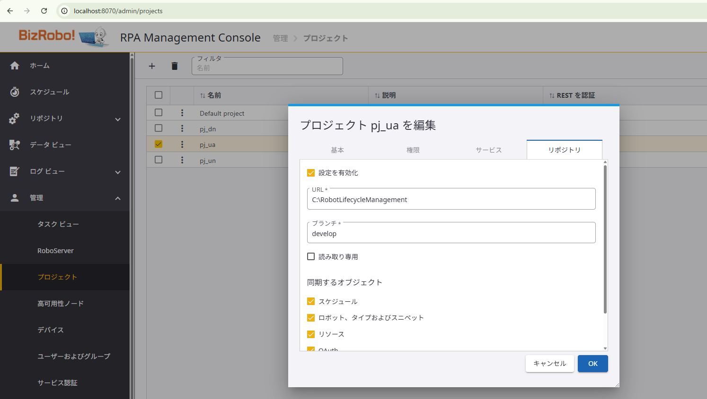

[ロボット ライフサイクル マネジメント（RLM）](index.md) の導入イメージをクリアにするために、最低限度のセットアップ手順と、運用手順についてまとめます。

RLM の真価（[末尾参照](#Git連携ツールを利用する意義)）は GitHub や GitLab などの Git 連携ツールを利用することにより発揮されますが、ここでは RLM という仕組みの理解を優先して Git の操作についてはコマンドを直接操作する形式で説明します。

<br>

## ロボット ライフサイクル マネジメント基盤のセットアップ

### 前提条件

- BizRobo! Lite での運用を想定し、`Management Console` 、`RoboServer` 、 `Synchronizer`、`Git` はすべて同じ端末にセットアップします。
- BizRobo! `v11.5.0.5` に対して RLM のセットアップを行います。
- `Synchronizer` は `RoboServer` に同梱されてインストールされるため、RLMの挙動自体に `RoboServer` は直接関与しませんが、対象の端末には `RoboServer` をインストールしておく必要があります。 
- `Git` は別途端末にインストールしましょう。
　  
	BizRobo! Lite では `Management Console` は1台のため、本番用のプロジェクト（`pj_ua_prod`: `prod` ブランチ）と開発用のプロジェクト（`pj_ua`: `develop` ブランチ）を用意して、両者を連携させる前提で記述します。[^1]

	以降の記述では、`Design Studio` で作成したロボットが `pj_ua` プロジェクトにアップロードされた状態をスタートとして `Synchronizer` を起動します。（`pj_ua_prod` プロジェクトは空の状態）

	

[^1]: ただし、実際 BizRobo! Lite において、このような構成をとるのは意味がありません。今回は RLM のハンズオンを想定しているためこのような構成にしていますが、Lite において RLM を活用するのであれば、`develop`リポジトリのみを用意し、いざというときの切り戻しのために、本番環境へのアップロード情報を履歴として記録しておくといった利用法が適切だと思います。

<br>

### RLM用リポジトリの作成

以下のコマンドにより RLM用のベア リポジトリを作成するのとともに、`Promotion Manager` が管理作業を行うための作業用リポジトリの作成（クローン）をします。

**ベアリポジトリの初期化**
場所は任意ですが、本記事では `C:\` 直下に `RobotLifecycleManagement` 問う名前でベア リポジトリを作成します。
```shell
:: ベアリポジトリ用のディレクトリ作成
C:\Users\ore> mkdir C:\RobotLifecycleManagement

C:\Users\ore> cd C:\RobotLifecycleManagement

:: ベアリポジトリの初期化
C:\RobotLifecycleManagement> git init --bare
```

**作業用リポジトリの作成**
同様に場所は任意ですが、本記事ではログインユーザー（`Promotion Manager`を想定）のデスクトップ上にローカルリポジトリを作成します。
```shell
:: デスクトップ上にRLMという名前で作業用リポジトリを作成（クローン）
C:\RobotLifecycleManagement> cd ..

C:\> git clone RobotLifecycleManagement C:\Users\ore\Desktop\RLM
```

**ブランチの作成と初期化**
初期状態は作業用のブランチが存在しないため、ローカルリポジトリで作成後、ベア リポジトリ（中央リポジトリ）に同期します。
```shell
C:\> cd C:\Users\ore\Desktop\RLM

:: プロジェクトのヒストリーを開始するための「ルートコミット」を作成します。
::    `--allow-empty` は、ファイルに変更がなくてもコミットを作成できるオプションです。
::   プロジェクトの基点を作るためによく使われます。
C:\Users\ore\Desktop\RLM>git commit --allow-empty -m "initial commit"

:: `develop` という名前の新しいブランチを作成し (`-b`)、そのブランチに移動 (`checkout`) します。
C:\Users\ore\Desktop\RLM> git checkout -b develop

:: developブランチを中央リポジトリにpushし、上流ブランチを設定
C:\Users\ore\Desktop\RLM> git push -u origin develop:develop

:: `prod` という名前の新しいブランチを作成し (`-b`)、そのブランチに移動 (`checkout`) します。
C:\Users\ore\Desktop\RLM> git checkout -b prod

:: prodブランチを中央リポジトリにpushし、上流ブランチを設定
C:\Users\ore\Desktop\RLM> git push -u origin prod:prod
```

<br>

### Synchronizer の起動方法

`Synchronizer` の起動にはパラメータの設定が必要です。パラメータの仕様については [ヘルプサイト](https://docshield.tungstenautomation.com/RPA/ja_JA/11.5.0-nlfihq5gwr/help/rpa_help/All_Shared/c_startsynch.html) で内容を確認しましょう。

そのうえで、まずはパラメータを設定しないで起動するとどうなるのか見てみましょう。（単なる興味です）
`Synchronizer` がインストールされているフォルダにカレントディレクトリを移したうえで実行します。

**パラメータを付けずに起動**  
```shell
C:\Users\ore> cd C:\Program Files\BizRobo Basic 11.5.0.5\bin

C:\Program Files\BizRobo Basic 11.5.0.5\bin>Synchronizer.exe
--> Wrapper がコンソールとして開始しました
JVM 起動中…
WrapperManager: Initializing...
2025-07-29 14:53:03,267  WARN com.kapowtech.synchronizer.runtime.Settings - [EVENT UNSPECIFIED -> /com.kapowtech.synchronizer.runtime.Settings] No settings given, falling back on defaults (use -h to for help)
2025-07-29 14:53:03,271  INFO com.kapowtech.synchronizer.runtime.Settings - [EVENT UNSPECIFIED -> /com.kapowtech.synchronizer.runtime.Settings] Set mc_url = http://localhost:8080/ManagementConsole
2025-07-29 14:53:03,271  INFO com.kapowtech.synchronizer.runtime.Settings - [EVENT UNSPECIFIED -> /com.kapowtech.synchronizer.runtime.Settings] Set shared_secret = null
2025-07-29 14:53:03,271  INFO com.kapowtech.synchronizer.runtime.Settings - [EVENT UNSPECIFIED -> /com.kapowtech.synchronizer.runtime.Settings] Set shared_secret_file = null
2025-07-29 14:53:03,272  INFO com.kapowtech.synchronizer.runtime.Settings - [EVENT UNSPECIFIED -> /com.kapowtech.synchronizer.runtime.Settings] Set interval = 3
2025-07-29 14:53:03,272  INFO com.kapowtech.synchronizer.runtime.Settings - [EVENT UNSPECIFIED -> /com.kapowtech.synchronizer.runtime.Settings] Set private_key = C:\Users\ore\.ssh\id_rsa
2025-07-29 14:53:03,272  INFO com.kapowtech.synchronizer.runtime.Settings - [EVENT UNSPECIFIED -> /com.kapowtech.synchronizer.runtime.Settings] Set no_host_key = false
2025-07-29 14:53:03,272 ERROR com.kapowtech.synchronizer.runtime.Settings - [EVENT UNSPECIFIED -> /com.kapowtech.synchronizer.runtime.Settings] shared_secret or shared_secret_file is missing in default values
<-- Wrapper Stopped
```

どうやらデフォルト値が代わりに設定されるものの、`shared_secret` も `shared_secret_file` も null であるため、そのまま処理が終了します。

次に、以下の通りパラメータを指定して起動します。

**パラメータを指定して実行**
```shell
C:\Program Files\BizRobo Basic 11.5.0.5\bin>Synchronizer.exe -c ^
  --mc-url http://localhost:8080 ^
  --shared-secret fxxxxxxxxxxxxxAZP83ts5-KZCmat-WeuKz5NBBqwEmdDxxxxxxxxxg ^
  --interval 10 --no-host-key false ^
  --private-key p:\dummy -s
```

- `-c` により実行時パラメータとして指定する。
- `--mc-url` は各自の `Management Console` を指定
- `--shared-secret` は `Management Console` の（管理 > サービス認証 > シンクロナイザー）から共有シークレットを取得して指定[^2]
- `--interval` は、`Synchronizer` が同期する間隔。30秒～60秒ぐらいの間隔でもよさそう。
- `--no-host-key` については、今回 Git連携ツールと接続しないためどちらでもいいが、デフォルト値を採用
- `--private-key` についても、今回 Git連携ツールと接続しないため内容についてはダミー値を設定。ただし、設定必須項目のため省略はできない。
- `-s` によりコマンドラインに指定したパラメータをファイルに記録します。

[^2]: 共有シークレットを取得するためには管理者アカウントで `Management Console` にログインする必要があります。

> [!NOTE]
> - パラメータ設定の種類は3つ。
> 	- `-c` 実行時にキーと値のセットで指定
> 	- `-e` Docker上で `Scynchronizer` を動かす際のDockerの環境変数
> 	- なし。 `-c` と同時に `-s` オプションを付与し手実行すると、`synchronizer.settings` ファイルとしてパラメータが出力されます。そのため、`synchronizer.settings` ファイルの存在する環境においてはパラメータを指定することなく `Scynchronizer` を起動できます。
> 
> `synchronizer.settings` は `%LocalAppData%\Kofax RPA\11.5.0.5_549\Configuration` 配下に出力されます。

また、`Synchronizer` と連携する `Management Console` 側のリポジトリの設定を以下に示します。
URLに設定しているのが `Bare Git Repository` のパスです。今回は Git連携ツール を使用しないため、直接ローカルに中央リポジトリ（という位置づけになるベア リポジトリ）を作成します。



```shell
C:\Program Files\BizRobo Basic 11.5.0.5\bin>Synchronizer.exe -c ^
  --mc-url http://localhost:8080 ^
  --shared-secret fxxxxxxxxxxxxxAZP83ts5-KZCmat-WeuKz5NBBqwEmdDxxxxxxxxxg ^
  --interval 10 --no-host-key false ^
  --private-key p:\dummy

--> Wrapper がコンソールとして開始しました
JVM 起動中…
WrapperManager: Initializing...
2025-07-30 17:45:30,464  INFO com.kapowtech.synchronizer.Main - [EVENT UNSPECIFIED -> /com.kapowtech.synchronizer.Main] started Synchronizer for http://localhost:8080 with a poll interval of 10s
2025-07-30 17:45:31,346  INFO com.kapowtech.synchronizer.Main - [EVENT UNSPECIFIED -> /com.kapowtech.synchronizer.Main] starting the synchronization of pj_ua using com.kapowtech.synchronizer.git.GitSynchronizer
2025-07-30 17:45:31,813  INFO com.kapowtech.synchronizer.git.GitSynchronizer - [EVENT UNSPECIFIED -> /com.kapowtech.synchronizer.git.GitSynchronizer] cloned remote C:\RobotLifecycleManagement into local repository C:\Users\ore\AppData\Local\Kofax RPA\11.5.0.5_549\Data\Synchronizer\pj_ua_localhost_RobotLifecycleManagement_develop (b47774543aa6e8e97ec90a438428755d8773dad5)
2025-07-30 17:45:32,227  INFO com.kapowtech.synchronizer.Main - [EVENT UNSPECIFIED -> /com.kapowtech.synchronizer.Main] Missing unknown 17f5107aaf9041f927f2e0bf7710caf2f6181269. About to reset pj_ua and to try once more.
2025-07-30 17:45:32,453  INFO com.kapowtech.synchronizer.git.GitSynchronizer - [EVENT UNSPECIFIED -> /com.kapowtech.synchronizer.git.GitSynchronizer] cloned remote C:\RobotLifecycleManagement into local repository C:\Users\ore\AppData\Local\Kofax RPA\11.5.0.5_549\Data\Synchronizer\pj_ua_localhost_RobotLifecycleManagement_develop (b47774543aa6e8e97ec90a438428755d8773dad5)
2025-07-30 17:45:32,933  INFO com.kapowtech.synchronizer.Main - [EVENT UNSPECIFIED -> /com.kapowtech.synchronizer.Main] done synchronizing pj_ua 8f95476d370e537e8d1896aa091d73adfbf8e46d
2025-07-30 17:45:32,934  INFO com.kapowtech.synchronizer.Main - [EVENT UNSPECIFIED -> /com.kapowtech.synchronizer.Main] starting the synchronization of pj_ua_prod using com.kapowtech.synchronizer.git.GitSynchronizer
2025-07-30 17:45:33,042  INFO com.kapowtech.synchronizer.git.GitSynchronizer - [EVENT UNSPECIFIED -> /com.kapowtech.synchronizer.git.GitSynchronizer] cloned remote C:\RobotLifecycleManagement into local repository C:\Users\ore\AppData\Local\Kofax RPA\11.5.0.5_549\Data\Synchronizer\pj_ua_prod_localhost_RobotLifecycleManagement_prod (b47774543aa6e8e97ec90a438428755d8773dad5)
2025-07-30 17:45:33,056  INFO com.kapowtech.synchronizer.Main - [EVENT UNSPECIFIED -> /com.kapowtech.synchronizer.Main] Missing unknown b814041f7cd7a6fcae380650cd154846735f508b. About to reset pj_ua_prod and to try once more.
2025-07-30 17:45:33,193  INFO com.kapowtech.synchronizer.git.GitSynchronizer - [EVENT UNSPECIFIED -> /com.kapowtech.synchronizer.git.GitSynchronizer] cloned remote C:\RobotLifecycleManagement into local repository C:\Users\ore\AppData\Local\Kofax RPA\11.5.0.5_549\Data\Synchronizer\pj_ua_prod_localhost_RobotLifecycleManagement_prod (b47774543aa6e8e97ec90a438428755d8773dad5)
2025-07-30 17:45:33,243  INFO com.kapowtech.synchronizer.Main - [EVENT UNSPECIFIED -> /com.kapowtech.synchronizer.Main] done synchronizing pj_ua_prod b47774543aa6e8e97ec90a438428755d8773dad5
2025-07-30 17:45:43,288  INFO com.kapowtech.synchronizer.Main - [EVENT UNSPECIFIED -> /com.kapowtech.synchronizer.Main] starting the synchronization of pj_ua using com.kapowtech.synchronizer.git.GitSynchronizer
2025-07-30 17:45:43,390  INFO com.kapowtech.synchronizer.Main - [EVENT UNSPECIFIED -> /com.kapowtech.synchronizer.Main] done synchronizing pj_ua 8f95476d370e537e8d1896aa091d73adfbf8e46d
2025-07-30 17:45:43,391  INFO com.kapowtech.synchronizer.Main - [EVENT UNSPECIFIED -> /com.kapowtech.synchronizer.Main] starting the synchronization of pj_ua_prod using com.kapowtech.synchronizer.git.GitSynchronizer
2025-07-30 17:45:43,445  INFO com.kapowtech.synchronizer.Main - [EVENT UNSPECIFIED -> /com.kapowtech.synchronizer.Main] done synchronizing pj_ua_prod b47774543aa6e8e97ec90a438428755d8773dad5
2025-07-30 17:45:53,485  INFO com.kapowtech.synchronizer.Main - [EVENT UNSPECIFIED -> /com.kapowtech.synchronizer.Main] starting the synchronization of pj_ua using com.kapowtech.synchronizer.git.GitSynchronizer
2025-07-30 17:45:53,569  INFO com.kapowtech.synchronizer.Main - [EVENT UNSPECIFIED -> /com.kapowtech.synchronizer.Main] done synchronizing pj_ua 8f95476d370e537e8d1896aa091d73adfbf8e46d
2025-07-30 17:45:53,569  INFO com.kapowtech.synchronizer.Main - [EVENT UNSPECIFIED -> /com.kapowtech.synchronizer.Main] starting the synchronization of pj_ua_prod using com.kapowtech.synchronizer.git.GitSynchronizer
2025-07-30 17:45:53,627  INFO com.kapowtech.synchronizer.Main - [EVENT UNSPECIFIED -> /com.kapowtech.synchronizer.Main] done synchronizing pj_ua_prod b47774543aa6e8e97ec90a438428755d8773dad5
2025-07-30 17:46:03,675  INFO com.kapowtech.synchronizer.Main - [EVENT UNSPECIFIED -> /com.kapowtech.synchronizer.Main] starting the synchronization of pj_ua using com.kapowtech.synchronizer.git.GitSynchronizer
2025-07-30 17:46:03,774  INFO com.kapowtech.synchronizer.Main - [EVENT UNSPECIFIED -> /com.kapowtech.synchronizer.Main] done synchronizing pj_ua 8f95476d370e537e8d1896aa091d73adfbf8e46d
2025-07-30 17:46:03,774  INFO com.kapowtech.synchronizer.Main - [EVENT UNSPECIFIED -> /com.kapowtech.synchronizer.Main] starting the synchronization of pj_ua_prod using com.kapowtech.synchronizer.git.GitSynchronizer
2025-07-30 17:46:03,833  INFO com.kapowtech.synchronizer.Main - [EVENT UNSPECIFIED -> /com.kapowtech.synchronizer.Main] done synchronizing pj_ua_prod b47774543aa6e8e97ec90a438428755d8773dad5
：
```

**実行内容**
1. `Management Console`（http://localhost:8080） に対して 10秒間隔の監視を開始
2. リポジトリの設定に基づき、ローカルリポジトリを設定数分作成
	- プロジェクト `pj_ua` 、`pj_ua_prod` のベア リポジトリを確認し、ローカルリポジトリを clone
	- ログからはわからないが、おそらくブランチも作成（`pj_ua=develop`、`pj_ua_prod=prod`）
3. 全てのリポジトリに対して、10秒間隔での監視開始

<br>

### 同期確認

`Synchronizer` が起動して同期処理を開始したのち、`Management Console` の画面からその状況を確認します。
以下図のようにプロジェクト `pj_ua` のリビジョン番号が `local` ではなく `1c0c0c15a06....` というGitで発行される形式の文字列に変わっていれば、無事 `develop` ブランチについては同期ができたといえます。


この時点で `pj_ua_prod` プロジェクトにはロボットが登録されていないためリストには表示されませんが、後述の手順で `pj_ua` プロジェクトのロボットがマージされると下記のように同じリビジョン番号が付与されます。


> [!Important]  
> RLMによって同期される先のプロジェクト（今回の場合 `pj_ua_prod` ）については、プロジェクトのリポジトリ設定に対しては「読み取り専用」チェックを ON にすることを推奨します。
> 
> 仮に、`pj_ua_prod`が「読み取り専用」設定されておらず、間違って直接 `Management Console` にロボット等のオブジェクトを登録してしまった場合、`pj_ua` のリポジトリと状態の不整合（conflict）が発生し、`pj_ua_prod` への同期が止まってしまうこともあるので注意が必要です。[^3]

[^3]: 中身の違う同一オブジェクトが発見された場合、`develop` → `prod` へマージを行う際に conflict が発生します。また、conflict が発生しない場合でも `prod` 側だけに存在し、`develop` には存在しないオブジェクトが発生してしまうため、資材管理上もよろしくないでしょう。


<br>

### Synchronizer のサービス登録

`Synchronizer` のセットアップと挙動が確認出来たら、実運用に向けてWindowsのサービスに登録します。

#### Windows サービスの追加 
以下のコマンドを実行して、`Synchronizer` をWindowsサービスに追加します。
```shell
C:\Users\ore> cd C:\Program Files\BizRobo Basic 11.5.0.5\bin

C:\Program Files\BizRobo Basic 11.5.0.5\bin> ServiceInstaller.exe -i Synchronizer.conf ^
wrapper.ntservice.account=<domain\account> ^
wrapper.ntservice.password.prompt=true ^
wrapper.ntservice.name="Synchronizer_11.5.0.5" ^
wrapper.ntservice.starttype=MANUAL wrapper.syslog.loglevel=INFO
```

 - `wrapper.ntservice.name` は任意の名称をつけましょう。
 - `wrapper.ntservice.account` については、`RoboServer` のサービス起動ユーザーと合わせるのがいいでしょう。

#### Windows サービスの削除  
以下のコマンドを実行して、`Synchronizer` をWindowsサービスから削除します。
```shell
C:\Users\ore> cd C:\Program Files\BizRobo Basic 11.5.0.5\bin

C:\Program Files\BizRobo Basic 11.5.0.5\bin> ServiceInstaller.exe -r Synchronizer.conf ^
wrapper.ntservice.name="Synchronizer_11.5.0.5" 
```

- `wrapper.ntservice.name` は削除するサービスの名称を指定します。

<br>

## ロボット ライフサイクル マネジメントの実行（運用）

### 前提条件

- ロボット開発者とロボット管理者が分かれており、本番環境へのアクセスはロボット管理者に限られている。
- 開発・テスト環境と本番環境が `Management Console` 上でプロジェクトとして分離されており、本番用プロジェクトは「読み取り専用」設定により、RLMからのみ更新が可能な状態である。
- Git連携ツールは使用しないため、Gitクライアント（今回はGitに同梱されている`Git bash`）で更新作業を実施する

### RLM運用の基本的な流れ


### 通常運用（基本の型）

「毎週水曜日の12時実行」などとタイミングを決めたうえで、期限までに集まった依頼に対して週次更新を実施します。

1. 開発者からの依頼を受領する。（リビジョン番号を提示）
2. 週次での最新版を`develop` ブランチへ Pullして、ローカルリポジトリへ同期
3. 週次締め切り時点で依頼を受領したリビジョン番号までのコミット情報を `prod` ブランチへマージ
4. `prod` ブランチの内容を確認し、問題がなければ既定の時刻に`origin/prod` ブランチ（中央リポジトリ）へ Push して本番リリース

**gitでの処理**
```shell
# 1. 作業ディレクトリへ移動
$ cd /c/Users/ore/Desktop/RLM

# 2. 念のため最新のdevelopブランチに切り替え
$ git checkout develop

# 3. 中央リポジトリの最新情報を取得（重要！）
$ git pull
```

```shell
# 4. マージ先のブランチ（本番ブランチ）に切り替え
$ git checkout prod

# 5. developブランチをprodブランチにマージ(受け入れ)
$ git merge --no-ff develop　…　最新のコミットまでマージ
もしくは
$ git merge --no-ff <リビジョン番号>　…　指定したリビジョンのコミットまでマージ
```

> [!NOTE]  
> `--no-ff`: "No Fast-Forward" の略。
> - **Fast-Forward (デフォルトの挙動):** もし `prod` ブランチが `develop` が分岐してから一度も更新されていなければ、Gitはただ `main` のポインタを `develop` の最新コミットに移動させるだけです。ヒストリーが一直線になり、マージしたという事実が残りません。
> - **--no-ff (マージコミットを作成):** 上記の条件でも、必ず「`develop`を`main`にマージしました」という新しいコミット（マージコミット）を作成します。
> - **RLMにおける `--no-ff` の重要性:** このマージコミットが「開発版を本番に昇格させた」という明確な証拠としてヒストリーに残ります。いつ、誰が、どのバージョンの `develop` を昇格させたのかが一目瞭然となり、監査や問題発生時の原因追跡に極めて有効です。RLMのようなライフサイクル管理では、このオプションはほぼ必須と言えるでしょう。

```shell
# 6. マージ結果を中央リポジトリにpush
$ git push
```

<br>

### 本番更新後の切り戻し

RLMにより本番リリースしたロボットやスケジュールなどのオブジェクトに不備があり、リリース前の状態に切り戻したい場合に随時実施します。

1. 開発者からの依頼を受領する。（リビジョン番号を提示）
2. 本番環境の状態を切り戻すために `prod` を最新化
3. リビジョン番号を指定して `prod` ブランチを切り戻し`origin/prod` ブランチ（中央リポジトリ）へ Push して本番リリース
4. 同様に`develop` ブランチに `prod` ブランチをマージし、`origin/develop`ブランチ（中央リポジトリ）へもPushして開発・テスト用環境も切り戻す

```shell
# 1. 作業ディレクトリへ移動
$ cd /c/Users/ore/Desktop/RLM

# 2. 作業ブランチを prod に切り替え
$ git checkout prod

# 3. prod の状態を最新化
$ git pull

# 4. ブランチ構造とマージ状況をグラフ表示して把握
# ── ここで prod／develop／main の分岐点・マージ履歴を視覚的に確認し、
#      どのコミットを取り消す（revert する）かを決定している。
$ git log --oneline --graph
*   8ec7969 (HEAD -> prod, origin/prod) developにrevertをマージしない場合
|\
| * 6729b97 (origin/develop, develop) コミットメッセージ２
* | 0febaa2 コミットメッセージ１
* | e481bb4 Merge branch 'develop' into prod
|\|
:
```

```shell
# 5. develop 側の問題コミット 6729b97 を「親¹基準」で revert（まだコミットしない）
# ── 6729b97 はマージコミットなので -m 1 で「親¹」（＝develop 側）を残し、
#      prod に入ってしまった変更だけを打ち消すパッチを作成して index に追加。
$ git revert -m 1 --no-commit 6729b97

# 6. 生成された revert パッチを prod ブランチ上で確定
# ── prod の先頭に「ノイズ除去2」コミットが乗り、
#      以後のマージでこの取り消しが他ブランチへ伝搬できる状態に。
$  git commit -m "ノイズ除去2"

# 7. 最新履歴を再確認し、revert が HEAD にいることを確認
# ── ここで 4c58dea (ノイズ除去2) が prod の先頭にあることを目視確認。
$ git log --oneline --graph
* 4c58dea (HEAD -> prod) ノイズ除去2
*   8ec7969 (origin/prod) developにrevertをマージしない場合
|\
| * 6729b97 (origin/develop, develop) コミットメッセージ２
* | 0febaa2 コミットメッセージ１
* | e481bb4 Merge branch 'develop' into prod
|\|
:

# 8. prod ブランチの更新内容をリ中央リポジトリへ反映
# ── origin/prod に「ノイズ除去2」が追加され、
#      CI や他開発者が prod を取得しても同じ履歴になる。
$ git push
```

```shell
# 9. 作業ブランチを develop に切り替え
$ git checkout develop

# 10. prod で確定した取り消しを develop へ取り込む
# ── --no-ff でマージコミットを必ず生成し履歴を明示、
#      --no-commit でコンフリクトの有無を確認してからコミットする安全策。
$ git merge --no-ff --no-commit prod

# 11. マージ結果をコミットして develop を更新
# ── develop にも「ノイズ除去2」が反映され、
#      prod と develop 間の差分が解消される。 
$ git commit -m "developにrevertマージし、origin/develop にpushした場合"

# 12. develop ブランチの履歴を確認
# ── 6160483 マージコミットが develop の先頭に存在することを確認。
$ git log --oneline --graph
*   6160483 (HEAD -> develop) developにrevertマージし、origin/develop にpushした場合
|\
| * 4c58dea (origin/prod, prod) ノイズ除去2
| *   8ec7969 developにrevertをマージしない場合
| |\
| |/
|/|
* | 6729b97 (origin/develop) コミットメッセージ２
| * 0febaa2 コミットメッセージ１
| *   e481bb4 Merge branch 'develop' into prod
| |\
| |/
:

# 13. develop の変更を中央リポジトリへ反映
# ── origin/develop も prod と同じく問題コミットが取り消された状態になり、
#      今後の開発で同じノイズが再登場するリスクを低減。
$ git push
```

<br>

### その他の更新対応

上記で挙げた通常運用の他、開発者の数が多くロボットのリリースや更新が頻繁に起こる場合には、「コミットされたリストの一部だけをマージしたい」ということや、「何らかの理由で本番環境にPushできなくなってしまった（コンフリクトの発生）」ということが起こるでしょう。

また、`Git` を長期間運用していく中で日々履歴情報が蓄積してゆき、少しずつではありますがディスク容量を消費していきます。こちらについても **Git自体の運用設計** を行い、定期的に不要な履歴や使用しなくなったオブジェクトを削除するなどの考慮が必要になってきます。

ただし、上記のようなケースへの対応は **ロボット ライフサイクル マネジメント** に関する知識・ノウハウというよりは純粋に `Git` の運用に関する知識・ノウハウですので、解説については専門の書籍やインターネット上の情報に譲りたいと思います。

<br>

---

### Git連携ツールを利用する意義

Git は単体でも強力なバージョン管理システムですが、GitHub や GitLab といった連携ツール（ホスティングサービス）と組み合わせることで、その真価を最大限に引き出すことができます。特にチームでの開発や、厳格な運用管理が求められる場面では、これらのツールの利用が大きな効果をもたらします。

#### 1. 変更内容の可視化とレビュー文化の醸成

- **プルリクエスト（マージリクエスト）機能**:
     - 開発ブランチから本番ブランチへの変更を取り込む際に、必ず第三者のレビューと承認を挟むワークフローを構築できます。>     - コードや設定の変更点についてチーム内で議論し、品質を高め、ナレッジを共有する文化が根付きます。
     - RLM の文脈では、「開発環境で承認されたロボット」を本番環境へ昇格させる際の公式な承認プロセスとして機能します。

#### 2. CI/CD パイプラインによる自動化
 
- **テストとデプロイの自動化**:
     - プルリクエストが作成されたり、特定のブランチにマージされたりしたタイミングをトリガーに、自動テストやビルド、本番環境へのデプロイといった一連のプロセスを自動実行できます。
     - RLM と連携させることで、以下のような高度な自動化が可能です。
 - **静的解析**: ロボットファイル内に開発環境用の設定値（URL やファイルパスなど）が残っていないか自動でチェックする。
 - **自動変換**: 開発環境用のリソースを、本番環境用に自動で書き換えてからデプロイする。
 - **デプロイ承認**: テストがすべて成功した場合にのみ、マージ（本番反映）を許可する。

#### 3. ガバナンスとセキュリティの強化

- **厳格なアクセスコントロール**:
     - リポジトリやブランチごとに、誰が読み書きできるか、誰がマージできるかといった権限を細かく設定できます。
     - 本番環境（`prod`ブランチなど）を保護し、権限のないユーザーによる意図しない変更を防ぎます。
- **監査証跡の確保**:
     - 「誰が、いつ、何を、なぜ変更したか」がプルリクエストの履歴として明確に残るため、監査対応が容易になります。
- **セキュリティスキャン**:
     - コードに埋め込まれたパスワードや API キーなどの機密情報を自動で検知し、漏洩を未然に防ぐ機能も利用できます。

#### 4. 堅牢なバックアップとチームの知見集約

- **中央リポジトリとしての役割**:
     - クラウド上で堅牢に管理されるリポジトリは、ローカル環境や社内サーバーの障害に強い、信頼性の高いバックアップとなります。
- **Issue や Wiki による情報集約**:
     - 開発中の課題やバグを管理する Issue（課題管理）機能や、プロジェクトのドキュメントをまとめる Wiki 機能も提供されており、ロボット開発・運用に関する知見をチーム全体で集約・共有するプラットフォームとして活用できます。